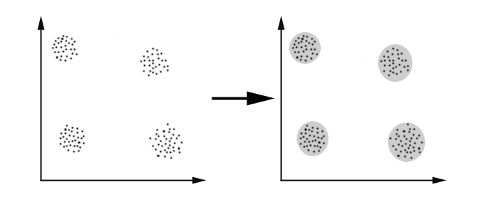
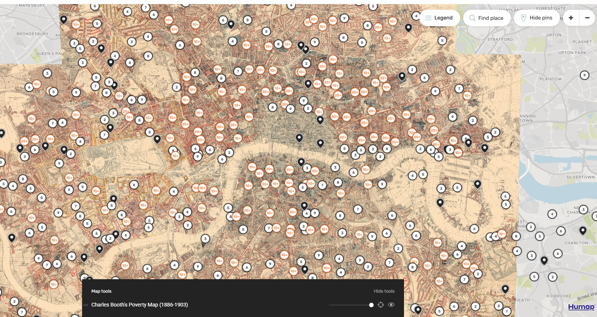
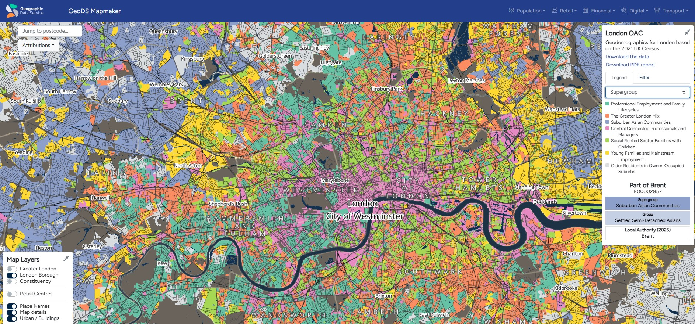
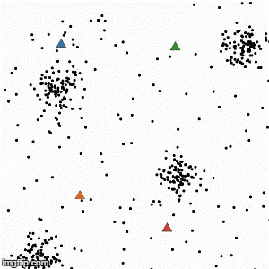
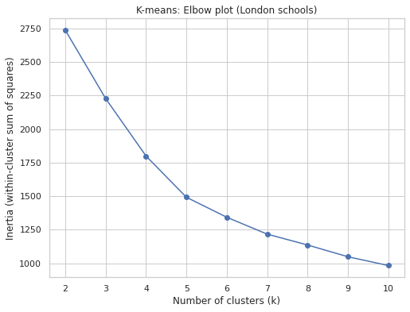
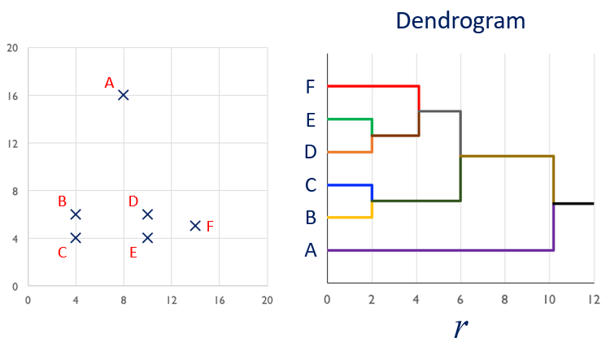
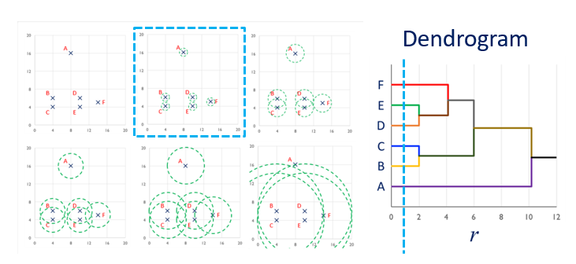
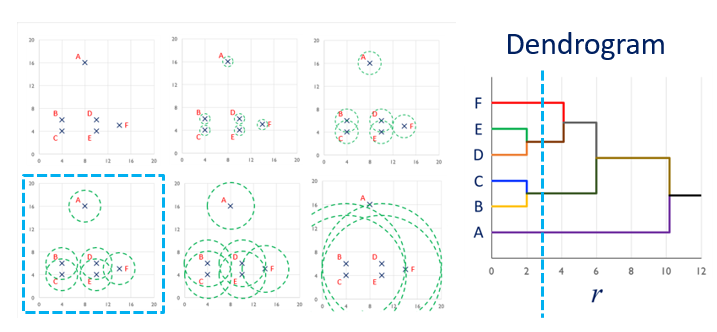
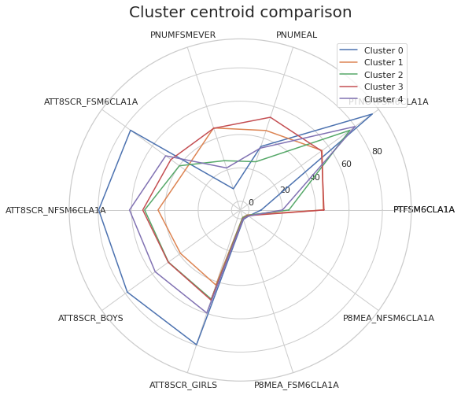
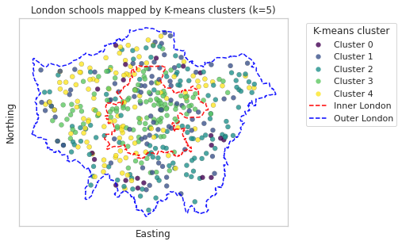

## Last week
**Lecture 9 - dimensionality reduction**

Looked at:

::: {.incremental}
- Understand the motivation of dimensionality reduction
- Understand the principle of Principal Component Analysis
- Can apply PCA to school datasets or other datasets  
:::

# This week 

## Objectives

- Understand the motivation and principle of clustering analysis.
- Understand K-Means and hierarchical clustering.
- Interpret the results of clustering analysis.

## What is clustering

- Type of analysis that divides data points into groups based on some similarity criteria
- A *cluster* is a group of similar data points

  
  

    Image credit: 
  

## Motivation of clustering

- Discover groups of similar data points
- Assist visualisation

## Examples of clustering - Booth map

  
  

    Image credit: https://booth.lse.ac.uk/map
  

## Examples of clustering - London Output Area Classification

- Clustering OAs on 70+ socio-economic variables (non-spatial); 32000 OAs clustered into 8 groups
- Clusters have obvious spatial patterns but aren’t spatially connected

  
  

    Image credit: https://mapmaker.geods.ac.uk/
  

## Process of conducting clustering analysis

::: {.incremental}
- Standardise variables
- Choose clustering algorithms (one or several)
- Select parameters of the clustering algorithm
- Interpret the results
- Finalise the clustering model
:::

# K-Means

## Steps {.nostretch}

:::: columns

::: {.column width="40"}

  
  

    Image credit: imageflip.com
  

:::

::: {.column width="60%"}
Iterative process (*Expectation-Maximisation algorithm*)

- Place k centroids [randomly]{style="color:blue"} within space
- Assign data points to nearest centroid
- Recalculate centroids as the new [mean]{style="color:blue"} of the cluster
- Continue until centroid assignments no longer change

:::
::::

## Implications of *centroid as mean of data points in a cluster*

::: {.incremental}
- K-Means is incapable of handling categorical variables, as we can't calculate the mean of a categorical variable
- K-Means is *sensitive* to outliers, as an outlier significantly impacts the mean of a dataset
:::

## Problems with K-Means and solutions

::: {.incremental}

- Sensitive to outliers [(solution: use another clustering method, or remove outliers)]{style="color:blue"}
- Incapable of handling categorical variables [(solution: k-modes or k-prototypes)]{style="color:blue"}
- Requires knowledge of the number of clusters (*k*), which we may not know in advance [(solution: Elbow method to find *k*)]{style="color:blue"}
- Sensitive to centroid initialisation, which can lead to poor solutions [(solution: try multiple random initialisation and pick up the best one; initialise centroid based on data distribution)]{style="color:blue"}

:::

## K-Means implementation in *sklearn*

- class sklearn.cluster.KMeans(n_clusters=8, *, [init='k-means++']{style="color:blue"}, [n_init='auto']{style="color:blue"}, max_iter=300, tol=0.0001, verbose=0, random_state=None, copy_x=True, algorithm='lloyd')
- By default, this function uses *init='kmeans++'*, which selects initial cluster centroids using sampling based on an empirical probability distribution of the points’ contribution to the overall inertia

## K-Means implementation in *sklearn*: output

- cluster_centers_: ndarray of shape (n_clusters, n_features). Coordinates of cluster centers.
- labels_: ndarray of shape (n_samples,). Labels of each point
- [inertia_]{style="color:blue"}: float. [Sum of squared distances of samples to their closest cluster center]{style="color:blue"}, weighted by the sample weights if provided.
- n_iter_: int. Number of iterations run.
- n_features_in_: int. Number of features seen during fit.

## Selecting K

1. Try different values of *k*.  
2. Plot the **inertia** (within-cluster sum of squares).  
3. Use the **elbow method** to pick a reasonable *k* where the decrease of inertia starts to flatten out.

## Selecting K - example

  
  

    Result: k=5 is appropriate.
  

# Hierarchical clustering

- Two ways of hierarchical clustering
  - [*agglomerative*]{style="color:blue"}: bottom-up; begin with one cluster per data point and gradually merge into larger clusters.
  - *divisive*: top-down; begin with one big cluster and gradually split into smaller clusters 

## Process
- Start with every point in its own cluster
- Merge points according to a linkage criterion (or distance)
- Compute centroid of new clusters
- Expand linkage threshold and continue until all points in one cluster

## Advantage of hierarchical clustering

- No prior knowledge of data required
- Users can choose the level in a hierarchy structure or use Elbow methosd (similar to K-Means)

## Linkage criterion (distance between two clusters)

- **ward**: to minimizes the variance of the clusters being merged (default setting for sklearn *AgglomerativeClustering*)
- **average**: the average of the distances of each data points of the two clusters
- **complete** (or maximum): the maximum distances between all data points of the two clusters
- **single**: the minimum of the distances between all observations of the two sets

## Example of hierarchical clustering

  
  

  

## Example of hierarchical clustering (continued)

  
  

  

## Example of hierarchical clustering (continued)

  
  

  

# Interpreting clustering (agnostic to clustering methods)

## Cluster centroid as representative

  
  

  

## Mapping

  
  

    To check if schools belonging to a cluster are geographically clustered
  

## Key takeaways 

- Clustering analysis aims to identify groups within data points. It is a type of unsupervised learning.
- K-Means and hierarchical clustering are two popular clustering techniques.
- We can interpret clustering results via visualising the cluster centroids or mapping the clusters.

## Practical 
- The practical will focus on clustering analysis of the school data.
- Have you questions prepared! 