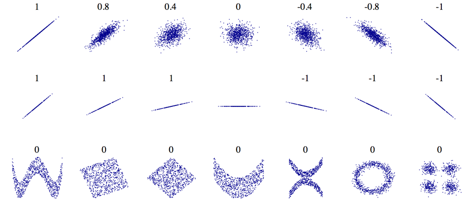
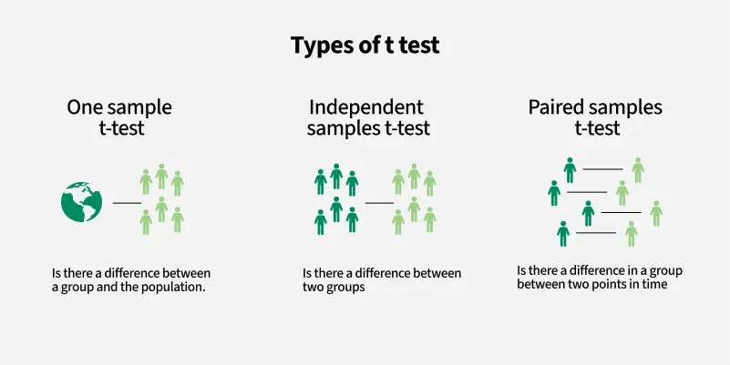
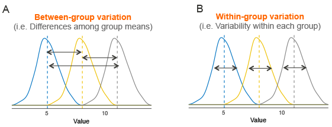

## Last week
**Lecture 4 - linear algebra**

Looked at:

::: {.incremental}
- Can use mathematical notation to write equations in a univeral language 
- Linear algebra helps us to solve systems of linear equations  
:::

# This week 

## Objectives

- Understand and calcualte Pearson and Spearman correlation between two variables.
- Understand the difference between Pearson and Spearman correlation.
- Understand ANOVA.

## Classification of statistical analysis

::: {.incremental}
- *Univariate* analysis (for one variable) (W1/2)
- *Bivariate* analysis (for two variables) (W5)
- *Multivariate* analysis (for multiple variables) (Further weeks; *very common in GIS*)
:::

## Back to W1: Descriptive statistics of each variable

The most basic statistical information about the dataset and each variable (separately) 

::: {.incremental}
- Sample size
- Mean, median, mode
- Variance, standard deviation 
- Range 
:::

## Variance: quantifying spread
Denote city population by $[y_1, y_2, ..., y_n]$ and variance by $\sigma^2$

$$
\begin{aligned}
\sigma^2 &= \frac{\sum_{i=1}^{n} (y_i - \bar{y})^2}{n} \\
&= \frac{(y_1 - \bar{y})^2 + (y_2 - \bar{y})^2 + \dots + (y_n - \bar{y})^2}{n}
\end{aligned}
$$

## Checklist when you learn a new metric ...

Let's take *variance* as an exmaple

| Questions            | Answer           |
|-------------------------|-------------------------|
| Does it exist for all inputs?          | <span class="fragment">Yes</span>|
| Meaning of sign (+/-)           | <span class="fragment">Non-negative; 0 means all values are identical</span>|
| Range           | <span class="fragment">[0, ∞)</span>|
| Is it normalised (i.e. in [-1,1] or [0,1])           | <span class="fragment">No</span>|
| Is it symmetric, if it involves multiple inputs?           | <span class="fragment">N/A</span>|

## Extending variance to two variables: do A and B change in the same direction? To what extent?

Examples:

::: {.incremental}
- Is the transport accessibility of a neighbourhood related to average housing price?
- Is a student's attendance in Quantitative Methods related to their performance in the module?
- For schools in England, is the proportion of pupils who are disadvantaged related to the average attainment 8 score? [*social & education inequality*]    
:::

## Covariance

$$
\mathrm{Cov}(x, y) = \frac{1}{n} \sum_{i=1}^{n} \left( x_i - \bar{x} \right) \left( y_i - \bar{y} \right)
$$


## Example

::: columns
::: {.column width="60%"}
```{python}
#| echo: false
#| fig-width: 6
#| fig-height: 6

import pandas as pd
import matplotlib.pyplot as plt

# Create dataframe
df = pd.DataFrame({
    'x': [0.8, 5.2, 1.5, 4.7],
    'y': [1.2, 0.9, 5.3, 4.5]
}, index=[1, 2, 3, 4])

# Calculate mean
mean_x = df['x'].mean()
mean_y = df['y'].mean()

# Plot
plt.figure(figsize=(6, 6))
plt.scatter(df['x'], df['y'], color='black', s=60)
plt.scatter(mean_x, mean_y, color='red', s=80)

# Annotate points
for idx, row in df.iterrows():
    plt.text(row['x'] + 0.1, row['y'] + 0.1, str(idx), fontsize=10, color='black')
plt.text(mean_x + 0.1, mean_y + 0.1, 'Mean', fontsize=10, color='red')

# Quadrant lines
plt.axvline(mean_x, color='gray', linestyle='--')
plt.axhline(mean_y, color='gray', linestyle='--')

# Formatting
plt.xlabel('x')
plt.ylabel('y')
plt.title('Scatter Plot with Quadrants and Mean Point')
plt.grid(True)
plt.tight_layout()
plt.show()
```
:::

::: {.column width="40%"}
Compute row by row before summing up
```{python}
#| echo: false
#| output: asis

# Calculate differences from mean using mean symbols
df['x - x̄'] = df['x'] - mean_x
df['y - ȳ'] = df['y'] - mean_y

# Calculate product of deviations
df['(x - x̄)(y - ȳ)'] = df['x - x̄'] * df['y - ȳ']

# Add index as a column label for display
# df.index.name = 'index'

# Print an extra line before the table to improve readability
# print("\nDifferences from the mean:\n")

# Display the table
print("\n<div style='font-size:0.8em'>")
print(df[['x - x̄', 'y - ȳ', '(x - x̄)(y - ȳ)']].round(2).to_markdown(tablefmt="github"))
print("</div>")
cov_sum = df['(x - x̄)(y - ȳ)'].sum()
n = len(df)
covariance = cov_sum / n

# Build string of individual terms
values_str = " + ".join([f"{v:.2f}" for v in df['(x - x̄)(y - ȳ)']])

# Print single clear calculation line
print(f"\nCovariance\n = ({values_str}) / {n} \n= {covariance:.2f}")

```
:::
:::

## Checklist for covariance

| Questions            | Answer           |
|-------------------------|-------------------------|
| Does it exist for all inputs?          | <span class="fragment">Yes</span>|
| Meaning of sign (+/-)           | <span class="fragment">Positive: x, y change in the same direction</span>|
| Range           | <span class="fragment">[-∞, ∞)</span>|
| Is it normalised (i.e. in [-1,1] or [0,1])           | <span class="fragment">No</span>|
| Is it symmetric, if it involves multiple inputs?           | <span class="fragment">Yes, cov(x,y)=cov(y,x)</span>|

## Crisis of covariance: incomparable

::: {.incremental}
- Does Cov = -0.39 tell how much x and y change together, apart from the direction?
- Assuem three variables A,B,C.
  - Cov(A,B) = -0.39
  - Cov(A,C) = -0.01
  - Can we say which A and B are more closely related compared with A and C?
  - [No]{style="color:blue"}
:::

## Improvements
::: {.incremental}
- Factors underlying Cov(A,B) 
  1. Direction & extent of A and B changing together
  1. [Magnitude of variability in A and B separately]{style="color:blue"}
- Ideally, we want to remove #2.
- Normalisation is the solution. But how? 
:::
 
# Pearson correlation
## Definition
$$
r_{xy} = \frac{\mathrm{Cov}(X, Y)}{\sigma_X \, \sigma_Y}
= 
\frac{\frac{1}{n} \sum_{i=1}^{n} (x_i - \bar{x})(y_i - \bar{y})}
{\sqrt{\frac{1}{n} \sum_{i=1}^{n} (x_i - \bar{x})^2} \;
 \sqrt{\frac{1}{n} \sum_{i=1}^{n} (y_i - \bar{y})^2}}
$$

- $\sigma_X$ denotes the [standard deviation]{style="color:blue"} of $x$ variable.
- Used to measure the [linear]{style="color:blue"} relationship between two variables.
- *How close the data points fall on a straight line*

## Quiz: what is the *unit* of Covariance and Correlation?
- *unit* of values is very important in quantitative analysis.
- You are investigating the relationship between outdoor temperature (in unit of $^\circ\text{C}$) and fire service call rates (in unit of $\text{minute}^{-1}$). What is the unit of the covariance?
- *A.* $^\circ\text{C} \cdot \text{minute}^{-1}$
- *B.* unitless
- *C.* $^\circ\text{C}$
- *D.* $^{\circ}\text{C}^{2} \cdot \text{minute}^{-2}$

## In the same analysis, what is the unit of correlation?
$$
r_{xy} = \frac{\mathrm{Cov}(X, Y)}{\sigma_X \, \sigma_Y}
= 
\frac{\frac{1}{n} \sum_{i=1}^{n} (x_i - \bar{x})(y_i - \bar{y})}
{\sqrt{\frac{1}{n} \sum_{i=1}^{n} (x_i - \bar{x})^2} \;
 \sqrt{\frac{1}{n} \sum_{i=1}^{n} (y_i - \bar{y})^2}}
$$

- *A.* $^\circ\text{C} \cdot \text{minute}^{-1}$
- *B.* unitless
- *C.* $^\circ\text{C}$
- *D.* $^{\circ}\text{C}^{2} \cdot \text{minute}^{-2}$

## History of Pearson correlation
:::: {.columns}

::: {.column width="40%"}

<div style="text-align:center;">
  
  <div style="font-size:0.8em; color: #555; margin-top:4px;">
    Francis Galton
    Image credit: https://commons.wikimedia.org/wiki/File:Portrait_of_Francis_Galton._Wellcome_M0002305.jpg
  </div>
</div>

<div style="text-align:center;">
  
  <div style="font-size:0.8em; color: #555; margin-top:4px;">
    Karl Pearson
    Image credit: https://commons.wikimedia.org/wiki/File:Karl_Pearson,_1912.jpg
  </div>
</div>

:::

::: {.column width="60%"}

- This idea was developed by Karl Pearson, based on earlier idea from Francis Galton (in 1880s).
- Karl Pearson is also known for other significant contributions to statistics, including chi-square test.
- $\chi^2 = \sum_{i=1}^{k} \frac{(O_i - E_i)^2}{E_i}$, measures how closely the observed data match the expected values.

:::

::::

## Checklist of Pearson correlation

| Questions            | Answer           |
|-------------------------|-------------------------|
| Does it exist for all inputs?          | <span class="fragment">Not when variance of x or y equals 0</span>|
| Meaning of sign (+/-)           | <span class="fragment">Positive: x, y change in the same direction</span>|
| Range           | <span class="fragment">[-1, 1)</span>|
| Is it normalised (i.e. in [-1,1] or [0,1])           | <span class="fragment">Yes</span>|
| Is it symmetric, if it involves multiple inputs?           | <span class="fragment">Yes, Cor(x,y)=Cor(y,x)</span>|

## Hypothesis testing and p-values of Pearson correlation
```{python}
#| echo: true        # Show the Python code in the slide
#| code-block-style: pycon
#| warning: false    # Hide warnings in the output
import numpy as np
from scipy import stats
res = stats.spearmanr([1, 2, 3, 4, 5], [5, 6, 7, 8, 7])
print(f"Pearson correlation = {res.statistic:.4f}")
print(f"P value = {res.pvalue:.4f}")
```

## Back to hypothesis testing
- There are various ways to test if Pearson correlation is statistically significant. 
- One way is using Student's t-distribution, assuming X & Y have a bivariate normal distribution.
- **$H_0$** (null hypothesis): no correlation between X & Y (or cor = 0)
$$
t = \frac{r}{\sigma_r} = \frac{r \sqrt{n - 2}}{\sqrt{1 - r^2}}
$$

Where:  
- $t$ = t-statistic  
- $r$ = calculated Pearson correlation coefficient  
- $n$ = number of paired observations  

## Examples
Question: does cor = 0 mean [no relationship]{style="color:blue"} between X and Y? [NO]{style="color:blue"}
<!-- <div style="text-align:center;">
  
</div> -->
<div style="text-align:center;">
  
  <div style="font-size:0.8em; color: #555; margin-top:4px;">
    Image credit: https://commons.wikimedia.org/wiki/File:Correlation_examples.png
  </div>
</div>

## #1 Limitation: not working well with non-linear relationship

:::{.incremental}
- Pearson correlation only measures linear association between X and Y.
- It is not a good metric of association if the scatterplot has a non-linear or curved pattern.
- When presenting the correlation, it is always good to [include a scatterplot]{style="color:blue"}.
:::

## #2 Limitation: sensitivity to ourliers

::: {.incremental}
- Pearson correlation involves the average of X and Y and difference between values.
- Therefore, it is sensitive to outliers.
- Again, a scatterplot will help detect outliers.
- If there are obvious ouliers in the data, please address them before conducting analysis.
:::

## #3 Limitations: not working with nominal or ordinal data

::: {.incremental}
- Pearson correlation doesn't work for nominal or ordinal data
- ... as we can't compute the mean or difference on nominal/ordinal data.
:::

# Spearman correlation (Spearman's Rho)
## Motivation

::: {.incremental}
- If I'd like to check if X and Y are consistenly increasing/decreasing (aka monotonic), rather than if they fall on a line
- How can I achieve it?
- *monotonic* relationship is a more general than *linear* relationship. 
- For example, $y = x^3$ is monotonic but not linear.
- [Solution]{style="color:blue"}: rank X and Y separately, and then calculate Pearson correlation on the ranked values (rather than orignal values).
:::

## Example
```{python}
#| echo: false
#| output: asis

import pandas as pd
import numpy as np
from scipy.stats import spearmanr

# Step 1: Generate random (x, y) values
np.random.seed(0)  # For reproducibility
x = np.random.rand(10)
y = np.random.rand(10)

# Create a DataFrame
df = pd.DataFrame({'x': x, 'y': y})

# Step 2: Print the original values as a transposed markdown table
print("\nOriginal Values:\n")
print(df.T.round(2).to_markdown())

# Step 3: Rank the values (average ranks for ties)
df['rank_x'] = df['x'].rank()
df['rank_y'] = df['y'].rank()

# Print the ranks as a transposed markdown table
print("\nStep 1: Ranks:\n")
print(df[['rank_x', 'rank_y']].T.to_markdown())

# Step 4: Calculate Spearman correlation
spearman_corr, _ = spearmanr(df['x'], df['y'])
print(f"\nStep 2: Spearman Correlation = {spearman_corr:.4f}")
```

## Examples
- Spearman correlation doesn't tell if or how much the relationship is linear
- Spearman & Pearson correlation on the same data are incomparable, as they tell different things.
```{python}
#| echo: false
#| fig-width: 6
#| fig-height: 6
import matplotlib.pyplot as plt
import numpy as np

X = np.random.uniform(size=100)

Y = np.log(X/(1-X))

Y = np.sign(Y)*np.abs(Y)**1.4

cc = np.cov(X,Y)
cc = cc[0,1]/np.sqrt(cc[0,0]*cc[1,1])

plt.clf()
plt.figure(figsize=(4,3.8))
plt.axes([0.17,0.12,0.8,0.75])
plt.plot(X, Y, 'o', color='orange')
plt.grid(True)
plt.title("Spearman correlation=1\nPearson correlation=%.2f" % cc)
plt.xlabel("X", size=16)
plt.ylabel("Y", size=16)
plt.xlim(-0.05,1.05)
plt.tight_layout()
plt.show()
```

## Spearman correlation is robust to ourliers (more than Pearson correlation)

```{python}
#| echo: false
#| output: asis

import pandas as pd
import numpy as np
from scipy.stats import pearsonr, spearmanr

# Step 1: Generate random (x, y) values
np.random.seed(0)  # For reproducibility
x = np.random.rand(10)
y = np.random.rand(10)

df = pd.DataFrame({'x': x, 'y': y})

# Step 2: Print original data
# print("### Original Values\n")
# print(df.T.round(2).to_markdown(index=False))
print('On original data, increase the largest X value by 1000')

# Step 3: Calculate and print original Pearson & Spearman correlations
pearson_corr_orig, _ = pearsonr(df['x'], df['y'])
spearman_corr_orig, _ = spearmanr(df['x'], df['y'])
print(f"\nOriginal Pearson C = **<span style='color:blue'>{pearson_corr_orig:.4f}</span>**, ")
print(f"Spearman C = **<span style='color:red'>{spearman_corr_orig:.4f}</span>**")

# Step 4: Increase the largest value in x by 1000
max_index = df['x'].idxmax()
df.loc[max_index, 'x'] += 1000

# Step 5: Highlight updated x value in red (Markdown formatting)
df_highlight = df.copy().round(2)
df_highlight = df_highlight.astype(str)
df_highlight.loc[max_index, 'x'] = f"**<span style='color:red'>{df_highlight.loc[max_index, 'x']}</span>**"

print("\n### Updated Values\n")
print(df_highlight.T.to_markdown(index=False))

# Step 6: Calculate and print updated Pearson & Spearman correlations
pearson_corr_updated, _ = pearsonr(df['x'], df['y'])
spearman_corr_updated, _ = spearmanr(df['x'], df['y'])
print(f"\nUpdated Pearson C = **<span style='color:blue'>{pearson_corr_updated:.4f}</span>**, ")
print(f"Spearman C = **<span style='color:red'>{spearman_corr_updated:.4f}</span>**")
```

## Spearman correlation applies to ordinal data (while Pearson correlation doesn't)
|                          | Nominal | Ordinal | Interval | Ratio |
|--------------------------|:-------:|:-------:|:--------:|:-----:|
| Pearson correlation |❌|❌| ✅ | ✅ |
| Spearman correlation |❌| ✅ |✅ |✅|

## *Potential* limitation of Spearman correlation
::: {.incremental}
- It lies in computational cost for big data
- Spearman correlation requires *sorting* on X and Y, which is not very efficient on big data
:::

# ANOVA (Analysis of Variance)
## Motivation
::: {.incremental}
- Pearson/Spearman correlation applies for ordinal/interval/ratio variables.
- What if we want to understand the relationship between a *nominal* variable and a *continuous* one?
- For example - in school data, we have average attainment of boys and girls per school. are *gender* and *attainment* correlated?
- Let's rephrase this question as: is there a significant difference on attainment between boys and girls? (*Does this sound familiar*)
:::

## Motivation continued - back to W3 *Hypothesis Testing*

<div style="text-align:center;">
  
  <div style="font-size:0.8em; color: #555; margin-top:4px;">
    Image credit: https://www.geeksforgeeks.org/data-science/t-test/
    
  </div>
</div>

- *Are gender and attainment are correlated* can be answered by paired samples t-test.

## Motivated continued - what if there are three or more groups?
::: {.incremental}
- Is there significant difference in school-average attainment across London councils of Camden, Westminster, and Islington?
- ANOVA (ANalysis Of Variance): used to determine if *multiple groups* are statistically significantly *different*.
:::

## Theory behind ANOVA

::: {.block height="50%"}
::: {.incremental}
- Step 1: break down total variance of values into two parts. Total-variance = within-group-variance + between-group-variance
- Step 2：$F$ = between-group variance / within-group variance
- Step 3: calculate the probability of $F$ greater than or equal to computed $F$. Under Null Hypothesis (there is no significant difference between groups), $F$ follows a F-distribution and $E[F]=1$.
:::
:::

::: {.block height="50%"}
<div style="text-align:center;">
  
  <div style="font-size:0.8em; color: #555; margin-top:4px;">
    Image credit: datanovia.com
  </div>
</div>
:::

## ANOVA has (many) assumptions
::: {.incremental}
- **Independence of observations**: each subject belongs to only 1 group; every observation is independent of others
- **No significant outliers exist**
- **Normality**: The data are approximately normally distributed
- **Homogeneity of variances**: variance of the outcome variable should be similar in all groups
- *These assumptions need to be tested before conducting ANOVA*
:::

## Assumptions and Testing

| Assumption       | Testing  |
|------------------|-----------------------------------------|
| **Independence of observations**  | Design-based check, randomization review |
| **No significant outliers**      | Boxplots/Z-scores; be cautious when removing outliers            |
| **Normality**                 | Shapiro–Wilk test; Q–Q plots          |
| **Homogeneity of variances**           | Levene test, Welch test|

## ANOVA is flexible
| Feature | **One-Way ANOVA**  | **Two-Way ANOVA**|
|------------------|--------------------|------------------|
| **Purpose**      | Compare means of three or more groups based on **one factor**    | Compare means based on **two factors** and their interaction     |
| **Example**      | Do school attainments vary across LA (Camden/Islington/Westminster)?    | Do school attainments vary across LA (Camden/Islington/Westminster) & gender (male/female)?     |
| **Assumptions**  | Normality, no outliers, homogeneity of variances, independence   | Same as one-way plus assumptions for interaction effects          |
| **Output**   | F-statistic, p-value for group differences    | F-statistics and p-values for each factor and interaction effects |

## Key takeaways 

- Can use Pearson/Spearman correlation to measure the relationship between two variables.
- Choose Pearson or Spearman correlation metric based on the dataset and interpret them correctly.
- To measure difference between two groups, use (paired) t-test
- To measure difference between multiple groups, use one-way ANOVA
- To measure difference across two variables, use two-way ANOVA

## Practical 
- The practical will focus on calculating and interpreting correlation metrics.  
- Have you questions prepared! 

