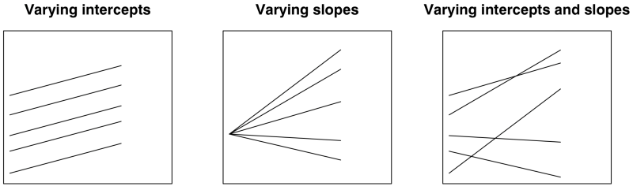

```{r}
#| message: false
#| warning: false
#| include: false
library(casaviz)
library(tidyverse)
library(sf)
library(plotly)
library(leaflet)
library(rgl)
library(dplyr)
library(here)
library(stringr)
library(dplyr)
library(purrr)
library(janitor)
library(readxl)
library(tibble)
library(ggrepel)
library(gganimate)
library(interactions)
library(jtools)
#all england schools
edubase_schools <- read_csv("https://www.dropbox.com/scl/fi/fhzafgt27v30lmmuo084y/edubasealldata20241003.csv?rlkey=uorw43s44hnw5k9js3z0ksuuq&raw=1") %>% 
  clean_names() %>% 
  filter(phase_of_education_name == "Secondary") %>% 
  filter(establishment_status_name == "Open") %>% 
  mutate(urn = as.character(urn))

#read in Brighton Secondary Schools Data
brighton_sec_schools <- read_csv("https://www.dropbox.com/scl/fi/fhzafgt27v30lmmuo084y/edubasealldata20241003.csv?rlkey=uorw43s44hnw5k9js3z0ksuuq&raw=1") %>% 
  clean_names() %>% 
  filter(la_name == "Brighton and Hove") %>% 
  filter(phase_of_education_name == "Secondary") %>% 
  filter(establishment_status_name == "Open") %>%
  st_as_sf(., coords = c("easting", "northing")) %>% 
  st_set_crs(27700)

btn_urn_list <- brighton_sec_schools %>% 
  select(urn) 

england_abs <- read_csv(here("sessions","L6_data", "Performancetables_130242", "2022-2023", "england_abs.csv"), na = c("", "NA", "SUPP", "NP", "NE"))
england_census <- read_csv(here("sessions","L6_data", "Performancetables_130242", "2022-2023", "england_census.csv"), na = c("", "NA", "SUPP", "NP", "NE"))
england_ks4final <- read_csv(here("sessions","L6_data", "Performancetables_130242", "2022-2023", "england_ks4final.csv"), na = c("", "NA", "SUPP", "NP", "NE"))
england_school_information <- read_csv(here("sessions","L6_data", "Performancetables_130242", "2022-2023", "england_school_information.csv"), na = c("", "NA", "SUPP", "NP", "NE"))

la_codes <- read_csv(here("sessions","L6_data", "Performancetables_130249", "2022-2023", "la_and_region_codes_meta.csv"), na = c("", "NA", "SUPP", "NP", "NE")) %>% 
  clean_names()

england_ks4final <- england_ks4final %>%
  mutate(URN = as.character(URN)) %>%
  mutate(across(TOTPUPS:PTOTENT_E_COVID_IMPACTED_PTQ_EE, ~ parse_number(as.character(.))))

england_ks4final <- england_ks4final %>%
  filter(!is.na(URN))

england_abs <- england_abs %>%
  mutate(URN = as.character(URN))

england_census <- england_census %>%
  mutate(URN = as.character(URN))

england_school_information <- england_school_information %>%
  mutate(URN = as.character(URN))

# Left join england_ks4final with england_abs
england_school_2022_23 <- england_ks4final %>%
  left_join(england_abs, by = "URN") %>%
  left_join(england_census, by = "URN") %>%
  left_join(england_school_information, by = "URN")

data_types <- sapply(england_school_2022_23, class)
england_school_2022_23_meta <- data.frame(Field = names(data_types), DataType = data_types)

btn_sub <- england_school_2022_23 %>%
  filter(URN %in% btn_urn_list$urn)

#P8_BANDING
england_school_2022_23_not_special <- england_school_2022_23 %>%
  filter(MINORGROUP != "Special school" & ADMPOL.x == "NSE")

eng_sch_2022_23_not_special_plus <- england_school_2022_23_not_special %>% left_join(
  edubase_schools, by = join_by(URN == urn)
)


calculate_index_of_dissimilarity <- function(df, col_A, col_B) {
  # Ensure the dataframe has the necessary columns
  required_columns <- c(col_A, col_B)
  if (!all(required_columns %in% colnames(df))) {
    stop(paste("Dataframe must contain the columns:", paste(required_columns, collapse = ", ")))
  }
  
  # Calculate the total number of disadvantaged and non-disadvantaged pupils
  total_A <- sum(df[[col_A]], na.rm = TRUE)
  total_B <- sum(df[[col_B]], na.rm = TRUE)
  
  # Calculate the index of dissimilarity
  df$dissimilarity_component <- abs(df[[col_A]] / total_A - df[[col_B]] / total_B)
  index_of_dissimilarity <- 0.5 * sum(df$dissimilarity_component, na.rm = TRUE)
  
  return(index_of_dissimilarity)
}

calculate_gorard_segregation <- function(df, col_A, col_T) {
  # Ensure the dataframe has the necessary columns
  required_columns <- c(col_A, col_T)
  if (!all(required_columns %in% colnames(df))) {
    stop(paste("Dataframe must contain the columns:", paste(required_columns, collapse = ", ")))
  }
  
  # Calculate the total number of disadvantaged pupils and total pupils
  total_A <- sum(df[[col_A]], na.rm = TRUE)
  total_T <- sum(df[[col_T]], na.rm = TRUE)
  
  # Calculate the Gorard Segregation Index
  df$gorard_component <- abs(df[[col_A]] / total_A - df[[col_T]] / total_T)
  gorard_segregation <- 0.5 * sum(df$gorard_component, na.rm = TRUE)
  
  return(gorard_segregation)
}


# Apply the functions to each LEA and create a new dataframe with the results
results_df <- england_school_2022_23_not_special %>%
  group_by(LEA) %>%
  group_map(~ tibble(
    LEA = .y$LEA,
    index_of_dissimilarity = calculate_index_of_dissimilarity(.x, col_A = "TFSM6CLA1A", col_B = "TNOTFSM6CLA1A"),
    gorard_segregation = calculate_gorard_segregation(.x, col_A = "TFSM6CLA1A", col_T = "TPUP")
  )) %>%
  bind_rows()


```

```{r}
#| eval: false
#| include: false
library(plotly)

# Assuming merged_df has columns:
# index_of_dissimilarity, gorard_segregation, la_name, region_name

fig <- plot_ly(
  data = merged_df,
  x = ~index_of_dissimilarity,
  y = ~gorard_segregation,
  type = 'scatter',
  mode = 'markers',
  color = ~region_name,       # Color by region
  text = ~la_name,            # Hover shows Local Authority name
  hoverinfo = 'text+x+y',
  marker = list(size = 6, opacity = 0.7)
) %>%
  layout(
    title = "Scatter Plot of Index of Dissimilarity vs Gorard Segregation, all LEAs in England",
    xaxis = list(title = "Index of Dissimilarity"),
    yaxis = list(title = "Gorard Segregation Index")
  )

fig
```

```{r}
#| message: false
#| warning: false

base_path <- here("sessions", "L6_data", "Performancetables_130242", "2022-2023")
na_all <- c("", "NA", "SUPP", "NP", "NE", "SP", "SN", "LOWCOV", "NEW", "SUPPMAT")

england_filtered <- read_csv(file.path(base_path, "england_filtered.csv"), na = na_all) |> mutate(URN = as.character(URN))

#str(england_filtered)

england_filtered_clean <- england_filtered[
  !is.na(england_filtered$ATT8SCR) & 
  !is.na(england_filtered$PTFSM6CLA1A) &
  england_filtered$ATT8SCR > 0 &
  england_filtered$PTFSM6CLA1A > 0, 
]

```

# This week

## Recap

-   Last week we saw how multiple regression models can allow us to understand complex relationships between predictor and outcome variables
-   We began to explore how by increasing the complexity of our regression models, we can begin to observe how the effects of different variables can confound (obscrure) and mediate (partially cause) the effects of others, giving us a deeper understanding of our system of interest
-   We were able to see that with just a relatively small number of variables, we could explain most of the variation in school-level attainment scores in England

## OLS regression with interaction terms

```{r}
#| message: false
#| warning: false
#| width: 80%
# Fit linear model and get predicted values
model_data <- england_filtered %>%
  filter(!is.na(ATT8SCR), !is.na(PTFSM6CLA1A), !is.na(PERCTOT))

model_data <- model_data %>%
  filter(
    is.finite(ATT8SCR), ATT8SCR > 0,
    is.finite(PTFSM6CLA1A), PTFSM6CLA1A > 0,
    is.finite(PERCTOT), PERCTOT > 0
  )

lm_fit1 <- lm(log(ATT8SCR) ~ log(PTFSM6CLA1A) + log(PERCTOT), data = model_data, na.action = na.exclude)

#summary(lm_fit1)

model_data <- model_data %>%
  mutate(
    fitted_ATT8SCR = exp(fitted(lm_fit1)),
    resids_real = ATT8SCR - fitted_ATT8SCR
  )

model_data$gor_name <- relevel(factor(model_data$gor_name), ref = "South East")
model_data$log_PERCTOT <- log(model_data$PERCTOT)
model_data$log_PTFSM6CLA1A <- log(model_data$PTFSM6CLA1A)

#lm_fit3a <- lm(log(ATT8SCR) ~ log_PTFSM6CLA1A + log_PERCTOT * gor_name, data = model_data)
lm_fit3a <- lm(log(ATT8SCR) ~ log_PERCTOT * gor_name, data = model_data)

#plot_summs(lm_fit3a, robust = TRUE)

casa_palette <- as.character(casa_colours[1:9])

#scale_colour_casa()
# or another palette like casa_dark

interactions::interact_plot(
  lm_fit3a,
  pred = "log_PERCTOT",
  modx = "gor_name",
  plot.points = F,
  facet.modx = F,
  colors = casa_palette
)

england_model1 <- lm(log(ATT8SCR) ~ log(PTFSM6CLA1A), data = england_filtered_clean)

```

-   In our most sophisticated model we could even see how the relationship between our main predictor and our outcome might vary between levels of a categorical variable

## OLS regression with Interaction Terms

-   Interacting categorical variables with other continuous predictor variables allowed us to see how levels of continuous predictor slope coefficient vary according to the categorical predictor
-   In our example, we saw how in a simple bivariate model of Attainment 8 vs Disadvantage, the slope less severe in regions such as London, the West Midlands and Yorkshire and the Humber when compared to the South East.
-   The effects of concentrations of disadvantaged pupils in schools felt more severely in the South East.

## Drawbacks of OLS with Interaction

-   OLS assumes all observations (schools) are independent of each other, when in reality, they may have characteristics which mean they are not independent - i.e. they are in the same local authority or have similar Ofsted ratings which mean they share some characteristics with each other in terms of governance etc.
-   OLS assumes the effects (parameters) are constant (fixed) across the whole population / dataset
-   OLS assumes the errors are independent
-   OLS only has one global intercept with group level differences in the data only crudely represented with dummy variables

## Different Slopes and Intercepts - Attainment 8

```{r}
filtered_data <- england_filtered_clean %>%
  filter(OFSTEDRATING != "Inadequate" & !is.na(OFSTEDRATING))
filtered_region <- england_filtered_clean %>%
  filter(OFSTEDRATING != "Inadequate" & !is.na(OFSTEDRATING) & !is.na(gor_name))
btn_sub <- filtered_region %>%
  filter(URN %in% btn_urn_list$urn)

# Base plot with england_school_2022_23
plot <- ggplot(filtered_data, aes(y = log(ATT8SCR), x = log(PTFSM6CLA1A), colour = OFSTEDRATING)) +
  geom_point() +
  geom_smooth(method = "lm", se = FALSE) +  # Add linear model line for england_school_2022_23
  labs(title = "Attainment 8 vs % Deprived Students, 2022-23",
       x = "log(% Deprived Students)",
       y = "log(Attainment 8 Score)",
       color = "Ofsted Rating") +
  theme_minimal()

# Add another layer with btn_sub points and labels with sticks
plot #+ 
#  geom_point(data = btn_sub, aes(y = log(ATT8SCR), x = log(PTFSM6CLA1A)), color = "black") +
#  geom_smooth(data = btn_sub, aes(y = log(ATT8SCR), x = log(PTFSM6CLA1A)), method = "lm", se = FALSE, color = "black") +  # Add linear model line for btn_sub
#  geom_text_repel(data = btn_sub, aes(y = log(ATT8SCR), x = log(PTFSM6CLA1A), label = SCHNAME.x), color = "black", size = 3, nudge_y = c(-1.5, 1.5), force = 10, box.padding = 0.5, max.overlaps = 10, direction = "both") 
```

## Different Slopes and Intercepts - Attainment 8

```{r}
library(ggplot2)
library(dplyr)

# Step 1: Compute lm coefficients per Ofsted rating
lm_labels <- england_filtered_clean %>%
  group_by(OFSTEDRATING) %>%
  summarise(
    model = list(lm(log(ATT8SCR) ~ log(PTFSM6CLA1A))),
    .groups = "drop"
  ) %>%
  mutate(
    intercept = sapply(model, function(m) coef(m)[1]),
    slope = sapply(model, function(m) coef(m)[2]),
    label = paste0("y = ", round(slope, 2), "x + ", round(intercept, 2))
  )

# Step 2: Merge label positions (optional: use median values for placement)
label_positions <- england_filtered_clean %>%
  group_by(OFSTEDRATING) %>%
  summarise(
    x = 0,
    y = 3.2,
    .groups = "drop"
  )

lm_labels <- left_join(lm_labels, label_positions, by = "OFSTEDRATING")

# Step 3: Plot with annotations
ggplot(england_filtered_clean, aes(y = log(ATT8SCR), x = log(PTFSM6CLA1A), colour = OFSTEDRATING)) +
  geom_point() +
  geom_smooth(method = "lm", se = FALSE) +
  geom_text(data = lm_labels, aes(x = x, y = y, label = label), inherit.aes = FALSE, hjust = 0, size = 3.5) +
  labs(
    title = "Attainment 8 vs % Deprived Students, 2022-23",
    x = "log(% Deprived Students)",
    y = "log(Attainment 8 Score)",
    color = "Ofsted Rating"
  ) +
  theme_minimal() +
  facet_wrap(~ OFSTEDRATING)
```

```{r}
#| eval: false
#| include: false
filtered_data <- england_filtered_clean %>%
  filter(OFSTEDRATING != "Inadequate" & !is.na(OFSTEDRATING))
filtered_region <- england_filtered_clean %>%
  filter(OFSTEDRATING != "Inadequate" & !is.na(OFSTEDRATING) & !is.na(gor_name))
btn_sub <- filtered_region %>%
  filter(URN %in% btn_urn_list$urn)

# Base plot with england_school_2022_23
plot <- ggplot(filtered_data, aes(y = log(ATT8SCR), x = log(PERCTOT), colour = OFSTEDRATING)) +
  geom_point() +
  geom_smooth(method = "lm", se = FALSE) +  # Add linear model line for england_school_2022_23
  labs(title = "Attainment 8 vs Overall Absence %, 2022-23",
       x = "% Overall Absence",
       y = "Attainment 8 Score",
       color = "Ofsted Rating") +
  theme_minimal()

# Add another layer with btn_sub points and labels with sticks
plot + 
  geom_point(data = btn_sub, aes(y = log(ATT8SCR), x = log(PERCTOT)), color = "black") +
  geom_smooth(data = btn_sub, aes(y = log(ATT8SCR), x = log(PERCTOT)), method = "lm", se = FALSE, color = "black") +  # Add linear model line for btn_sub
  geom_text_repel(data = btn_sub, aes(y = log(ATT8SCR), x = log(PERCTOT), label = SCHNAME.x), color = "black", size = 3, nudge_y = c(-1.5, 1.5), force = 10, box.padding = 0.5, max.overlaps = 10, direction = "both") 
```

```{r}
#| eval: false
#| include: false
ggplot(england_filtered_clean, aes(y = log(ATT8SCR), x = log(PERCTOT), colour = OFSTEDRATING)) +
  geom_point() +
  geom_smooth(method = "lm", se = FALSE) +  # Add linear model line for england_school_2022_23
  labs(title = "Attainment 8 vs Overall Absence %, 2022-23",
       x = "% Overall Absence",
       y = "Attainment 8 Score",
       color = "Ofsted Rating") +
  theme_minimal() +
  facet_wrap(~ OFSTEDRATING)  # Facet plots for each Ofsted rating
```

## Different Slopes and Intercepts - Progress 8

```{r}

# Base plot with england_school_2022_23
library(ggplot2)

# Fit global linear model
global_model <- lm(P8MEA ~ PTFSM6CLA1A, data = filtered_data)
intercept <- round(coef(global_model)[1], 3)
slope <- round(coef(global_model)[2], 3)

# Create annotation text
annotation_text <- paste0("Global LM: y = ", intercept, " + ", slope, "x")

# Plot with individual colored lines and global black line
plot <- ggplot(filtered_data, aes(x = PTFSM6CLA1A, y = P8MEA, colour = OFSTEDRATING)) +
  geom_point(alpha = 0.7) +
  geom_smooth(method = "lm", se = FALSE) +  # Individual lines by OFSTEDRATING
  geom_smooth(method = "lm", se = FALSE, color = "black", aes(group = 1)) +  # Global line
  annotate("text", x = 10, 
           y = 2,
           label = annotation_text, hjust = 0, size = 4, color = "black") +
  labs(
    title = "Progress 8 vs % Deprived Students, 2022-23",
    x = "% Deprived Students",
    y = "Progress 8 Score",
    color = "Ofsted Rating"
  ) +
  theme_minimal()

# Add another layer with btn_sub points and labels with sticks
plot #+ 
#  geom_point(data = btn_sub, aes(y = P8MEA, x = PTFSM6CLA1A), color = "black") +
#  geom_smooth(data = btn_sub, aes(y = P8MEA, x = PTFSM6CLA1A), method = "lm", se = FALSE, color = "black") +  # Add linear model line for btn_sub
#  geom_text_repel(data = btn_sub, aes(y = P8MEA, x = PTFSM6CLA1A, label = SCHNAME.x), color = "black", size = 3, nudge_y = c(-1.5, 1.5), force = 10, box.padding = 0.5, max.overlaps = 10, direction = "both") 
```

## Different Slopes and Intercepts - Progress 8

```{r}
# Step 1: Compute lm coefficients per Ofsted rating
lm_labels <- england_filtered_clean %>%
  group_by(OFSTEDRATING) %>%
  summarise(
    model = list(lm(P8MEA ~ PTFSM6CLA1A)),
    .groups = "drop"
  ) %>%
  mutate(
    intercept = sapply(model, function(m) coef(m)[1]),
    slope = sapply(model, function(m) coef(m)[2]),
    label = paste0("y = ", round(intercept, 2), " + ", round(slope, 2), "x")
  )

# Step 2: Merge label positions (optional: use median values for placement)
label_positions <- england_filtered_clean %>%
  group_by(OFSTEDRATING) %>%
  summarise(
    x = 0,
    y = 2,
    .groups = "drop"
  )

lm_labels <- left_join(lm_labels, label_positions, by = "OFSTEDRATING")

ggplot(england_filtered_clean, aes(y = P8MEA, x = PTFSM6CLA1A, colour = OFSTEDRATING)) +
  geom_point() +
  geom_smooth(method = "lm", se = FALSE) +
  geom_text(data = lm_labels, aes(x = x, y = y, label = label), inherit.aes = FALSE, hjust = 0, size = 3.5) + 
  # Add linear model line for england_school_2022_23
  labs(title = "Progress 8 vs Overall Absence %, 2022-23",
       x = "% Overall Absence",
       y = "Attainment 8 Score",
       color = "Ofsted Rating") +
  theme_minimal() +
  facet_wrap(~ OFSTEDRATING)  # Facet plots for each Ofsted rating
  
```

## Different Slopes and Intercepts

-   Solution: can we just partition our data and run different models for different groups?
-   Answer: Well yes, you could, but we couldn't then answer questions about whether variation between individual schools is more important than between groups (e.g. local authorities or Ofsted ratings)

In order to model these grouping factors more explicitly and understand their general impact, we need a new type of model - a ***linear mixed effects model***

## Jargon Alert!

-   Before we embark on our linear mixed effects journey, there are two key pieces of jargon you need to learn
-   ***Fixed Effects*** - A Fixed Effect is your traditional explanatory variable (or covariate) whose relationship with the outcome you are primarily interested in estimating for its own sake.
    -   Example: Proportion of disadvantaged students in a school. You want the single, best-estimated coefficient ($\beta$) for this factor.
-   ***Random Effects*** - A Random Effect is a grouping factor (or nesting factor) whose variability you want to account for, but whose specific individual levels you don't necessarily want to draw conclusions about.
    -   Example: The different Ofsted ratings (or individual Schools). You're interested in how much the relationship varies across these groups, not the specific effect of 'Longhill School'

## Fixed Effects - More Detail

-   Fixed effects estimate the mean relationship across all groups. They represent the "fixed" part of the model that applies to every observation.
    -   You estimate a single $\beta$ coefficient for a fixed effect, which represents the population average effect of that variable.
    -   Fixed effects can be either continuous (e.g., % of disadvantaged students in a school) or categorical (region, Ofsted rating).
-   Depending on how you formulate your model, a fixed effect could be a random effect in a different context.


## Random Effects - More Detail

-   Random effects, (random intercepts and slopes) represent the deviations of each group's effect from the overall fixed-effect average.
    -   When you model a grouping factor (like Ofsted Rating) as a random effect, you are not estimating five separate coefficients (one for each rating).
    -   Instead, you estimate a variance term ($\sigma^2_{\text{group}}$) that quantifies how much the true group effects (intercepts and/or slopes) scatter around the overall mean effect.
    -   This approach is used when the groups (e.g., the 5 Ofsted categories or the hundreds of individual schools) are considered a random sample from a larger, unobserved population of groups.
    -   This allows the model to "borrow strength" across groups to stabilise estimates (the principle of shrinkage).
    
## Random Effects vs Dummy Variables

-   Random Effects and Dummy Variables are often exactly the same variable, they are just treated differently in a LME vs OLS model
-   In an OLS, the Dummy variable gets a specific coefficient value
-   In a LME, the random effect represents the overall variability that that variable brings to the explanation (i.e. how much variability in attainment is down to schools themselves ***generally***, rather than a particular school ***specifically***)
-   Where you might have lots of Dummy categories, a random effect might be more suitable


## Linear Mixed Effects Models

-   A Linear Mixed Effects (LME) model is a more general class of statistical model that features both a fixed-effects component (the population-average parameters) and a random-effects component (the group-specific deviations)
-   A common type of LME model is the ***multilevel model*** or hierarchical linear model.
    -   **Multilevel models** focus specifically on **nested** data structures, e.g. students in classes $\rightarrow$ classes within schools $\rightarrow$ schools within local authorities $\rightarrow$ local authorities within regions
-   All multilevel models are linear mixed effects models, but other types of linear mixed effects models can handle even more types of groupings (e.g. longitudinal - repeated observations over time)

## Linear Mixed Effects Models



-   In practice, LME models essentially result in varying intercepts, slopes or both.

Multilevel Data Structures (Source:[Gelman & Hill (2006)](http://www.stat.columbia.edu/~gelman/arm/)) and <https://paulrjohnson.net/blog/2022-11-01-multilevel-model-r-cheatsheet/>

## Linear Mixed Effects Models

```{r}
#| message: false
#| warning: false
library(GGally)

ggpairs(england_filtered_clean, , mapping = aes(color = OFSTEDRATING), columns = c("P8MEA", "PTFSM6CLA1A", "PERCTOT", "OFSTEDRATING"))


```

## The Null Model

-   The first step in a linear mixed effects model is to fit what is often called a ***null model*** (otherwise know as the ***'Variance Components'*** / ***'Unconditional Means'*** Model)
-   Point of the null model is to partition the total variance in the outcome variable (Progress 8 - P8MEA) into the levels or components we think are relevant.
-   In our example, we have:
    -   Schools (Level 1 - our primary unit) and
        -   Local authority (level 2) - or other grouping factors e.g. Ofsted rating,
            -   Region (level 3).

## The Null Model - a 2 Level example

```{r}
#| message: false
#| warning: false
#| align: center
#| out-width: 80%

# 1. Load the necessary library for plotting
library(ggplot2)

# --- Ensure OFSTEDRATING is an ordered factor for better plotting ---
# It appears you have six levels based on the OLS output, so we order them logically.
# Adjust the order if the true levels/baseline are different in your data.
rating_order <- c("Special Measures", "Serious Weaknesses", "Requires improvement", "Good", "Outstanding")
england_filtered_clean$OFSTEDRATING <- factor(
  england_filtered_clean$OFSTEDRATING,
  levels = rating_order,
  ordered = TRUE
)


## ## 1. Boxplot Visualization (Level 1 and Level 2 Variance) ## ##
boxplot_p8mea <- ggplot(england_filtered_clean, aes(x = OFSTEDRATING, y = P8MEA, fill = OFSTEDRATING)) +
  geom_boxplot(alpha = 0.7) +
  geom_hline(yintercept = mean(england_filtered_clean$P8MEA, na.rm = TRUE),
             linetype = "dashed", color = "black", linewidth = 1) +
  labs(
    title = "P8MEA Distribution Across Ofsted Ratings (The Null Model Structure)",
    subtitle = "Fixed Grand Mean (Dashed Line) and Random Intercepts (Box Medians)",
    x = "Ofsted Rating",
    y = "Progress 8 Score (P8MEA)"
  ) +
  theme_minimal() +
  theme(axis.text.x = element_text(angle = 45, hjust = 1), legend.position = "none")

print(boxplot_p8mea)


```

-   All of the information in the two-level NULL model is contained in this plot!

## The Null Model - a 2 Level example

$$Y_{ij} = \gamma_{00} + u_{0j} + \epsilon_{ij}$$ The total variability in outcome $Y_{ij}$ (Progress 8) for the $i^{th}$ school in the $j^{th}$ Ofsted rating is decomposed into:

-   **Fixed Effect**: $\gamma_{00}$ (The overall population average - **grand/global mean**).
-   **Random Effect - Level 1**: $\epsilon_{ij}$ - **Within-Group Variance** - the height of each individual box and the length of its whiskers. Taller boxes and longer whiskers indicate more variability among schools within that single rating category.
-   **Random Effect - Level 2**: $u_{0j}$ - **Between-Group Variance** 

## Level 1 - Within-Group Variance

$$
Y_{ij} = \beta_{0j} + \epsilon_{ij}
$$

-   **The Progress 8 Outcome**: $Y_{ij}$
-   **The within-group intercept**: $\beta_{0j}$ for the specific Ofsted rating $j$. This represents the true mean Progress 8 for all schools within that rating.\
-   **The Level 1 residual error**: $\epsilon_{ij}$ (or "school-level error"). This is the deviation of the $i^{th}$ school's P8MEA from its own Ofsted group's mean ($\beta_{0j}$).
    -   Assumption: $\epsilon_{ij} \sim N(0, \sigma^2_{\epsilon})$ where $\sigma^2_{\epsilon}$

## Level 1 - Within-Group Variance

$$\epsilon_{ij} \sim N(0, \sigma^2_{\epsilon})$$ 

|  |  |
|----|----|
| **Notation** | **Meaning** |
| $\epsilon_{ij}$ | The **Level 1 Residual Error** (or "within-group error") for the $i$-th school in the $j$-th Ofsted rating. | 
| $\sim$ | "Is distributed as" or "Follows the distribution." |
| $N(\dots)$ | The ***N***ormal (Gaussian) Distribution. 
| $0$ | The **Mean** of the distribution = 0. |
| $\sigma^2_{\epsilon}$ | The **Within-Group Variance** of the distribution. |

## Level 2 - Between-Group Variance

$$
\beta_{0j} = \gamma_{00} + u_{0j}
$$

-   Level 1 intercept $\beta_{0j}$: The mean Progress 8 for the $j^{th}$ Ofsted rating
-   **The grand mean** $\gamma_{00}$: the overall fixed intercept. This is the mean Progress 8 averaged across all Ofsted ratings. ***The dotted black line on our earlier plot***
-   **Level 2 residual error** $u_{0j}$: "group-level error". This is the deviation of the $j^{th}$ Ofsted rating's mean ($\beta_{0j}$) from the grand mean ($\gamma_{00}$).
    -   Assumption: $u_{0j} \sim N(0, \sigma^2_{u_{0}})$ where $\sigma^2_{u_{0}}$ is the Between-Group Variance (or Level 2 variance/Random Intercept Variance).

## Total Variance

1.  **Between-Group Variance** ($\sigma^2_{\text{Between}}$ - or more generally $\sigma^2_{u_{0}}$): The variability in average P8MEA that exists ***between*** the different Ofsted ratings.
2.  **Within-Group (Residual) Variance** ($\sigma^2_{\text{Within}}$ - or more generally $\sigma^2_{\epsilon}$): The variability in P8MEA that exists between schools ***within*** each rating (i.e., the school-level differences).
-   Total Variance is simply the sum of these two

$$\sigma^2_{\text{Total}} = \sigma^2_{\text{Between}} + \sigma^2_{\text{Within}}$$
$$\sigma^2_{\text{Total}} = \sigma^2_{u_{0}} + \sigma^2_{\epsilon}$$

## The Intraclass Correlation Coefficient (ICC)

The ICC tells you the proportion of the total variability in the outcome that is accounted for by the grouping structure.

-   It answers the question in our case: "How much of the total difference in Progress 8 is due to the school's Ofsted rating?"
-   It can also be interpreted as the expected correlation between any two randomly chosen schools within the same Ofsted rating.

## The Intraclass Correlation Coefficient (ICC)

$$\text{ICC} = \frac{\text{Between-Group Variance}}{\text{Total Variance}} = \frac{\sigma^2_{u_{0}}}{\sigma^2_{u_{0}} + \sigma^2_{\epsilon}}$$

-   This ICC is simply the ratio between the between the between group variance and the total variance
-   The higher the ICC (closer to 1), the more variance is due to differences between groups (i.e. differences between the Ofsted rating of schools) than within groups (i.e. between schools within Ofsted rating bands)
-   **A high ICC is a strong indication that a multilevel model is a suitable modelling strategy to pursue to try and explain these group-level differences**

## The ICC

```{r}
#| message: false
#| warning: false
#| align: center
#| out-width: 80%
## ## 2. Density Plot Visualization (Comparing the Two Variance Components) ## ##
# This plot visually shows how much the groups overlap (small overlap means high ICC).
density_p8mea <- ggplot(england_filtered_clean, aes(x = P8MEA, fill = OFSTEDRATING, color = OFSTEDRATING)) +
  geom_density(alpha = 0.4) +
  labs(
    title = "Density of Progress 8 (P8MEA) by Ofsted Rating",
    subtitle = "Low overlap suggests large differences between ratings (High ICC)",
    x = "Progress 8 Score (P8MEA)",
    y = "Density"
  ) +
  theme_minimal() +
  theme(legend.position = "bottom")

print(density_p8mea)
```

-   High ICC = distinct, non-overlapping humps
-   Low ICC = density plots all overlapping on-top of each other

## Linear Mixed Effects Model - General Syntax

`y ~ fixed_effect_x1 + (random_effect_slope_term_x1 | random_effect_group_g1)`

`y ~ fixed_effect_x1 + fixed_effect_x2 + fixed_effect_xn + (random_effect_slope_term_x1 | random_effect_group_g1) + (random_effect_slope_term_x2 | random_effect_group_g2) + (random_effect_slope_term_xn | random_effect_group_gn)`


## The Null Model - Syntax
-   Using Paul Johnson's excellent guide for syntax, the null model in R follows this format: `y ~ 1 + (1 | g)`
-   Here the fixed effects appear outside of the brackets. The first `1` outside of the brackets just tells the model to use a fixed global intercept
-   The random effects are inside the brackets `(...|...)`
    -    To the *left* of the pipe symbol `|` we have a `1` as all slopes are fixed in the null model
    -    To the *right* of the vertical bar or pipe symbol `|` we have the grouping variable `g`. 
-   The full model in R would like like: 

`lme_model1 <- lmer(P8MEA ~ 1 + (1 | OFSTEDRATING), data = ...)`

<https://paulrjohnson.net/blog/2022-11-01-multilevel-model-r-cheatsheet/>

## Running The Null Model

```{r}
#| message: false
#| warning: false
#| align: center
#| out-width: 80%
library(lme4)
library(performance)

#lm1 <- lm(P8MEA ~ PTFSM6CLA1A + OFSTEDRATING, data = england_filtered_clean)
#summary(lm1)

lme1 <- lmer(P8MEA ~ 1 + (1|OFSTEDRATING), data = england_filtered_clean)
summary(lme1)

```

## The ICC

```{r}
#| echo: true
library(performance)
icc(lme1, by_group = T)
```

## NULL Model Visualisation

```{r}
#| message: false
#| warning: false
#| align: center
#| out-width: 80%
library(lme4)
library(ggplot2)

# Fit the model
lme1 <- lmer(P8MEA ~ 1 + (1|OFSTEDRATING), data = england_filtered_clean)

# Extract random effects
ranef_df <- as.data.frame(ranef(lme1)$OFSTEDRATING)
ranef_df$OFSTEDRATING <- rownames(ranef(lme1)$OFSTEDRATING)

# Plot
ggplot(ranef_df, aes(x = OFSTEDRATING, y = `(Intercept)`)) +
  geom_point(size = 3) +
  geom_hline(yintercept = fixef(lme1)[1], linetype = "dashed", color = "red") +
  labs(title = "Varying Intercepts by OFSTED Rating",
       subtitle = "Model: P8MEA ~ 1 + (1 | OFSTEDRATING)",
       x = "OFSTED Rating",
       y = "Intercept") +
  theme_minimal()
```


```{r}
lme2 <- lmer(P8MEA ~ PTFSM6CLA1A + (1|OFSTEDRATING), data = england_filtered_clean)
summary(lme2)
```


```{r}
library(lme4)
library(ggplot2)

# Fit the model
lme2 <- lmer(P8MEA ~ PTFSM6CLA1A + (1|OFSTEDRATING), data = england_filtered_clean)

# Get fixed effect and random intercepts
fixed_intercept <- fixef(lme2)[1]
slope <- fixef(lme2)[2]
ranef_df <- as.data.frame(ranef(lme2)$OFSTEDRATING)
ranef_df$OFSTEDRATING <- rownames(ranef(lme2)$OFSTEDRATING)

# Create prediction grid
pop_range <- seq(min(england_filtered_clean$PTFSM6CLA1A),
                 max(england_filtered_clean$PTFSM6CLA1A), length.out = 100)

pred_df <- do.call(rbind, lapply(1:nrow(ranef_df), function(i) {
  intercept <- fixed_intercept + ranef_df$`(Intercept)`[i]
  data.frame(
    PTFSM6CLA1A = pop_range,
    P8MEA = intercept + slope * pop_range,
    OFSTEDRATING = ranef_df$OFSTEDRATING[i]
  )
}))

# Plot
ggplot(pred_df, aes(x = PTFSM6CLA1A, y = P8MEA, color = OFSTEDRATING)) +
  geom_line(size = 1.2) +
  labs(title = "Predicted P8MEA vs Population by OFSTED Rating",
       subtitle = "Model: P8MEA ~ PTFSM6CLA1A + (1 | OFSTEDRATING)",
       x = "PTFSM6CLA1A (Population Measure)",
       y = "Predicted P8MEA") +
  theme_minimal()
```

```{r}
lme3 <- lmer(P8MEA ~ PTFSM6CLA1A + (PTFSM6CLA1A|OFSTEDRATING), data = england_filtered_clean)
summary(lme3)
```


```{r}
library(lme4)
library(ggplot2)


# 1. Load Libraries (Assuming they are already loaded)
# library(lme4)
# library(ggplot2)

# 2. Fit the New Model with Random Slopes and Intercepts
lme3 <- lmer(P8MEA ~ PTFSM6CLA1A + (PTFSM6CLA1A | OFSTEDRATING), data = england_filtered_clean)

# 3. Get Fixed Effects and Random Effects
fixed_intercept <- fixef(lme3)[1] # Fixed overall intercept
fixed_slope <- fixef(lme3)[2]     # Fixed overall slope for PTFSM6CLA1A

# Extract Random Effects for both Intercept and Slope
ranef_df <- as.data.frame(ranef(lme3)$OFSTEDRATING)
ranef_df$OFSTEDRATING <- rownames(ranef(lme3)$OFSTEDRATING)

# Rename columns for clarity
colnames(ranef_df) <- c("RandomIntercept", "RandomSlope", "OFSTEDRATING")

# 4. Create Prediction Grid
# Use the same range for the predictor as before
pop_range <- seq(min(england_filtered_clean$PTFSM6CLA1A),
                 max(england_filtered_clean$PTFSM6CLA1A), length.out = 100)

pred_df_lme3 <- do.call(rbind, lapply(1:nrow(ranef_df), function(i) {
  
  # Calculate the group-specific intercept and slope:
  # Group Intercept = Fixed Intercept + Random Intercept for the Group
  group_intercept <- fixed_intercept + ranef_df$RandomIntercept[i]
  
  # Group Slope = Fixed Slope + Random Slope for the Group
  group_slope <- fixed_slope + ranef_df$RandomSlope[i]
  
  # Calculate predicted P8MEA for this group
  data.frame(
    PTFSM6CLA1A = pop_range,
    P8MEA = group_intercept + group_slope * pop_range,
    OFSTEDRATING = ranef_df$OFSTEDRATING[i]
  )
}))

# 5. Plot the Results
ggplot(pred_df_lme3, aes(x = PTFSM6CLA1A, y = P8MEA, color = OFSTEDRATING)) +
  geom_line(size = 1.2) +
  labs(title = "Predicted P8MEA vs Population by OFSTED Rating (Random Slopes)",
       subtitle = "Model: P8MEA ~ PTFSM6CLA1A + (PTFSM6CLA1A | OFSTEDRATING)",
       x = "PTFSM6CLA1A (Population Measure)",
       y = "Predicted P8MEA") +
  theme_minimal()
```


```{r}
## 1. Fit the New Model with Uncorrelated Random Slopes and Intercepts
lme4 <- lmer(P8MEA ~ PTFSM6CLA1A + (PTFSM6CLA1A || OFSTEDRATING), data = england_filtered_clean)
summary(lme4)
```


```{r}
library(lme4)
library(ggplot2)


## 1. Fit the New Model with Uncorrelated Random Slopes and Intercepts
lme4 <- lmer(P8MEA ~ PTFSM6CLA1A + (PTFSM6CLA1A || OFSTEDRATING), data = england_filtered_clean)

# 2. Get Fixed Effects and Random Effects
fixed_intercept <- fixef(lme4)[1] # Fixed overall intercept
fixed_slope <- fixef(lme4)[2]     # Fixed overall slope for PTFSM6CLA1A

# Extract Random Effects for both Intercept and Slope
# Note: ranef() returns the random effects in the same order as the fixed effects
ranef_df_lme4 <- as.data.frame(ranef(lme4)$OFSTEDRATING)

# Since the structure is (PTFSM6CLA1A || OFSTEDRATING), lme4 separates the two terms
# The columns are named based on the formula structure for uncorrelated terms
colnames(ranef_df_lme4) <- c("RandomIntercept", "RandomSlope") 
ranef_df_lme4$OFSTEDRATING <- rownames(ranef_df_lme4)

# 3. Create Prediction Grid
pop_range <- seq(min(england_filtered_clean$PTFSM6CLA1A),
                 max(england_filtered_clean$PTFSM6CLA1A), length.out = 100)

pred_df_lme4 <- do.call(rbind, lapply(1:nrow(ranef_df_lme4), function(i) {
  
  # Calculate the group-specific intercept and slope:
  # Group Intercept = Fixed Intercept + Random Intercept for the Group
  group_intercept <- fixed_intercept + ranef_df_lme4$RandomIntercept[i]
  
  # Group Slope = Fixed Slope + Random Slope for the Group
  group_slope <- fixed_slope + ranef_df_lme4$RandomSlope[i]
  
  # Calculate predicted P8MEA for this group
  data.frame(
    PTFSM6CLA1A = pop_range,
    P8MEA = group_intercept + group_slope * pop_range,
    OFSTEDRATING = ranef_df_lme4$OFSTEDRATING[i]
  )
}))

# 4. Plot the Results
ggplot(pred_df_lme4, aes(x = PTFSM6CLA1A, y = P8MEA, color = OFSTEDRATING)) +
  geom_line(size = 1.2) +
  labs(title = "Predicted P8MEA by OFSTED Rating (Uncorrelated Random Slopes)",
       subtitle = "Model: P8MEA ~ PTFSM6CLA1A + (PTFSM6CLA1A || OFSTEDRATING)",
       x = "PTFSM6CLA1A (Population Measure)",
       y = "Predicted P8MEA") +
  theme_minimal()
```


```{r}
lme5 <- lmer(P8MEA ~ 1 + (1|gor_name/LANAME), data = england_filtered_clean)
summary(lme5)

```


```{r}
lme6 <- lmer(P8MEA ~ PTFSM6CLA1A + (1|gor_name/LANAME), data = england_filtered_clean)
summary(lme6)
```

```{r}
lme7 <- lmer(P8MEA ~ PTFSM6CLA1A + (1|gor_name/LANAME) + (1|OFSTEDRATING), data = england_filtered_clean)
summary(lme7)
```


$$\texttt{lmer(P8MEA ~ PTFSM6CLA1A + (1 | gor_name/LANAME) + (1 | OFSTEDRATING), data = england\_filtered\_clean)}$$
#kitchen sink model!!

```{r}


lme8 <- lmer(P8MEA ~ PTFSM6CLA1A + (1|gor_name/LANAME) + (1|OFSTEDRATING), data = england_filtered_clean)
summary(lme7)
```

```{r}

# drop some rows with 0s in
england_filtered_clean <- england_filtered_clean %>%
  filter(PTFSM6CLA1A > 0, PERCTOT > 0, PNUMEAL > 0)

# Quick checks of non-finite values after logs
with(england_filtered_clean, table(is.finite(log(ATT8SCR)), useNA = "ifany"))
with(england_filtered_clean, table(is.finite(log(PTFSM6CLA1A)), useNA = "ifany"))
with(england_filtered_clean, table(is.finite(log(PERCTOT)), useNA = "ifany"))
with(england_filtered_clean, table(is.finite(log(PNUMEAL)), useNA = "ifany"))

# Show a few offending rows (if any)
bad_idx <- with(england_filtered_clean, 
  !is.finite(log(ATT8SCR)) |
  !is.finite(log(PTFSM6CLA1A)) |
  !is.finite(log(PERCTOT)) |
  !is.finite(log(PNUMEAL))
)
which(bad_idx)[1:20]
england_filtered_clean[bad_idx, c("ATT8SCR","PTFSM6CLA1A","PERCTOT","PNUMEAL")][1:10, ]

str(england_filtered_clean$OFSTEDRATING)
str(england_filtered_clean$gor_name)
str(england_filtered_clean$LANAME)
str(england_filtered_clean$ADMPOL_PT)

# Convert to factor if needed and drop unused levels
england_filtered_clean$OFSTEDRATING <- droplevels(as.factor(england_filtered_clean$OFSTEDRATING))
england_filtered_clean$gor_name      <- droplevels(as.factor(england_filtered_clean$gor_name))
england_filtered_clean$LANAME        <- droplevels(as.factor(england_filtered_clean$LANAME))
england_filtered_clean$ADMPOL_PT     <- droplevels(as.factor(england_filtered_clean$ADMPOL_PT))

# Quick NA check on grouping variables
sapply(england_filtered_clean[c("OFSTEDRATING","gor_name","LANAME")], function(x) sum(is.na(x)))

# Keep rows where all logs will be finite
finite_idx <- with(england_filtered_clean,
  is.finite(log(ATT8SCR)) &
  is.finite(log(PTFSM6CLA1A)) &
  is.finite(log(PERCTOT)) &
  is.finite(log(PNUMEAL))
)

sum(!finite_idx)  # rows to be dropped

eng_clean_log <- droplevels(england_filtered_clean[finite_idx, ])
```

```{r}
eng_clean_log <- transform(
  england_filtered_clean,
  log_ATT8SCR      = log(ATT8SCR),
  log_PTFSM6CLA1A  = log(PTFSM6CLA1A),
  log_PERCTOT      = log(PERCTOT),
  log_PNUMEAL      = log1p(PNUMEAL)   # handles zeros safely for a count
)

# Drop any rows where the truly-positive logs are not finite
eng_clean_log <- subset(eng_clean_log,
                        is.finite(log_ATT8SCR) &
                        is.finite(log_PTFSM6CLA1A) &
                        is.finite(log_PERCTOT) &
                        is.finite(log_PNUMEAL))


lme9 <- lmer(log(ATT8SCR) ~ log(PTFSM6CLA1A) + log(PERCTOT) + log(PNUMEAL) + PTPRIORLO + ADMPOL_PT + (1 | OFSTEDRATING) + (1 | gor_name/LANAME), data = eng_clean_log, na.action = na.exclude, REML = TRUE)
summary(lme9)

mm <- model.matrix(~ log(PTFSM6CLA1A) + log(PERCTOT) + log(PNUMEAL) + PTPRIORLO + ADMPOL_PT, data = eng_clean_log)

stopifnot(all(is.finite(mm)))
stopifnot(all(is.finite(model.response(model.frame(log(ATT8SCR) ~ 1, data = eng_clean_log)))))

table(eng_clean_log$OFSTEDRATING)
table(eng_clean_log$gor_name)
with(eng_clean_log, table(gor_name, LANAME))[1:5, 1:5]  # spot check
```


```{r}
england_filtered_clean <- england_filtered_clean %>%
  filter(PTFSM6CLA1A > 0, PERCTOT > 0, PNUMEAL > 0)

lme9 <- lmer(log(ATT8SCR) ~ log(PTFSM6CLA1A) + log(PERCTOT) + log(PNUMEAL) + PTPRIORLO + ADMPOL_PT + (1|OFSTEDRATING) + (1|gor_name/LANAME), data = england_filtered_clean, na.action = na.exclude)
summary(lme9)

# Convert fitted values back to original scale
#england_filtered_clean <- england_filtered_clean %>%
#  mutate(
#    fitted_lme9 = exp(lme9),
#    highlight = LANAME == "Brighton and Hove",
#    label = if_else(highlight, SCHNAME.x, NA_character_)
#  )
```

```{r}
#| message: false
#| warning: false
library(tidyverse)
library(ggrepel)

#Get fitted values with NA for excluded rows
fitted_vals <- fitted(lme9)

# Add fitted values to the dataframe
england_filtered_clean$lme9 <- fitted_vals


# Convert fitted values back to original scale
# Convert fitted values back to original scale
england_filtered_clean <- england_filtered_clean %>%
  mutate(
    fitted_lme9 = exp(lme9),
    highlight = LANAME == "Brighton and Hove",
    label = if_else(highlight, SCHNAME.x, NA_character_)
  )

# Scatter plot with layered points and full-model fit line
ggplot(england_filtered_clean, aes(x = fitted_lme9, y = ATT8SCR)) +
  # All schools in grey
  geom_point(color = "grey80", alpha = 0.5, size = 2) +

  # Brighton and Hove schools in orange
  geom_point(data = filter(england_filtered_clean, highlight),
             aes(x = fitted_lme9, y = ATT8SCR),
             color = "darkorange", size = 2.5) +

  # Labels for Brighton and Hove schools
  geom_text_repel(data = filter(england_filtered_clean, highlight),
                  aes(label = label),
                  size = 3, max.overlaps = 20) +

  # Line of best fit for all schools
  geom_smooth(method = "lm", se = TRUE, color = "black") +
  
# Mirror x and y axes
  coord_equal() +


  theme_minimal() +
  labs(
    title = "Observed vs Fitted ATT8SCR (Original Scale)",
    x = "Modelled Attainment 8, 2022-23",
    y = "Observed Attainment 8, 2022-23"
  )
```

```{r}
# 1. Ensure the 'lmerTest' package (or 'lme4') is loaded
#install.packages("lmerTest")
library(lmerTest) 
# Note: Since you already ran lmer, the necessary functions are likely available.

# 1. Extract the fitted values
fitted_lme9 <- fitted(lme9)

# 2. Extract the residuals
resid_lme9 <- resid(lme9)

# 3. Calculate the observed values used in the model
# Observed = Fitted + Residuals
observed_log_ATT8SCR_aligned <- fitted_lme9 + resid_lme9

# 4. Compute the squared correlation (Pseudo R-squared)
# Use 'pairwise.complete.obs' to handle NA values correctly
pseudo_R_squared <- cor(observed_log_ATT8SCR_aligned, 
                        fitted_lme9, 
                        use = "pairwise.complete.obs")^2

# 5. Display the result
print(paste("Pseudo R-squared (Conditional):", round(pseudo_R_squared, 4)))
```

```{r}
# If you haven't yet, fit the LMM (REML=TRUE equivalent to your lme9)
# lme9 <- lmer(log(ATT8SCR) ~ log(PTFSM6CLA1A) + log(PERCTOT) + log(PNUMEAL) +
#               PTPRIORLO + ADMPOL_PT + (1|OFSTEDRATING) + (1|gor_name/LANAME),
#             data = england_filtered_clean, na.action = na.exclude, REML = TRUE)

# MuMIn’s Nakagawa & Schielzeth R2 (marginal = fixed only; conditional = fixed + random)
r2_mumin <- MuMIn::r.squaredGLMM(lme9)
r2_mumin

# Alternative via performance (should match closely)
r2_perf <- performance::r2_nakagawa(lme9)
r2_perf
```

```{r}
# Refit your LMM by ML for fair AIC/BIC comparisons across LMMs
lme9_ml <- update(lme9, REML = FALSE)

# Refit OLS if needed (lm is fine as-is for logLik/AIC)
england_model7 <- lm(log(ATT8SCR) ~ log(PTFSM6CLA1A) + log(PERCTOT) + log(PNUMEAL) + OFSTEDRATING + gor_name + PTPRIORLO + ADMPOL_PT, data = england_filtered_clean, na.action = na.exclude)

# Compare AIC/BIC
AIC(england_model7, lme9_ml)
BIC(england_model7, lme9_ml)

# You can also compare nested LMMs via LRT (example below in step 4).
```

```{r}
# Caterpillar plots by grouping factor
sjPlot::plot_model(lme9, type = "re", sort.est = TRUE)
# You can specify groups:
sjPlot::plot_model(lme9, type = "re", sort.est = TRUE, group.terms = "OFSTEDRATING")
sjPlot::plot_model(lme9, type = "re", sort.est = TRUE, group.terms = "gor_name")
sjPlot::plot_model(lme9, type = "re", sort.est = TRUE, group.terms = "LANAME:gor_name")
```


```{r}
library(lattice)
re_list <- ranef(lme9, condVar = TRUE)  # includes conditional variances
# Dotplots for each grouping level
dotplot(re_list, scales = list(y = list(cex = 0.6)))
```

```{r}
# Tidy random effects (BLUPs) with SEs
re_tidy <- broom.mixed::tidy(lme9, effects = "ran_vals", conf.int = TRUE)
head(re_tidy)
# Example: filter LA-level intercepts
re_la <- subset(re_tidy, grepl("^LANAME:gor_name", group))

```

```{r}
# Start from ML-fitted baseline (random intercepts)
base_ml <- lme9_ml

# Add random slope for PTPRIORLO by LA within region
# Note: nesting as in your model: (1 + PTPRIORLO | gor_name:LANAME)
rslope_la_ml <- lmer(
  log(ATT8SCR) ~ log(PTFSM6CLA1A) + log(PERCTOT) + log(PNUMEAL) +
    PTPRIORLO + ADMPOL_PT +
    (1 | OFSTEDRATING) + (1 | gor_name/LANAME) +
    (0 + PTPRIORLO | gor_name:LANAME),  # use 0+ to avoid correlation if convergence issues
  data = england_filtered_clean, na.action = na.exclude, REML = FALSE
)

# Alternatively try a correlated slope:
# (1 + PTPRIORLO | gor_name:LANAME)

# LRT for nested models (base vs slope model)
anova(base_ml, rslope_la_ml)

# Try random slope by OFSTEDRATING instead:
rslope_ofsted_ml <- lmer(
  log(ATT8SCR) ~ log(PTFSM6CLA1A) + log(PERCTOT) + log(PNUMEAL) +
    PTPRIORLO + ADMPOL_PT +
    (1 + PTPRIORLO | OFSTEDRATING) + (1 | gor_name/LANAME),
  data = england_filtered_clean, na.action = na.exclude, REML = FALSE
)
anova(base_ml, rslope_ofsted_ml)
```
```{r}
lme_interact_ofsted <- lmer(
  log(ATT8SCR) ~ log(PTFSM6CLA1A) + log(PERCTOT) + log(PNUMEAL) +
    PTPRIORLO * OFSTEDRATING + ADMPOL_PT +
    (1 | OFSTEDRATING) + (1 | gor_name/LANAME),
  data = england_filtered_clean, na.action = na.exclude, REML = FALSE
)

summary(lme_interact_ofsted)
anova(lme9_ml, lme_interact_ofsted)  # test added interaction (ML)
```

