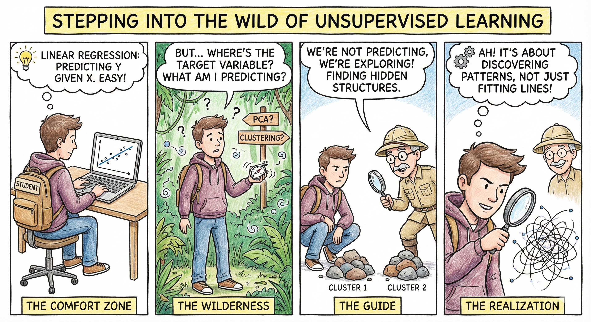
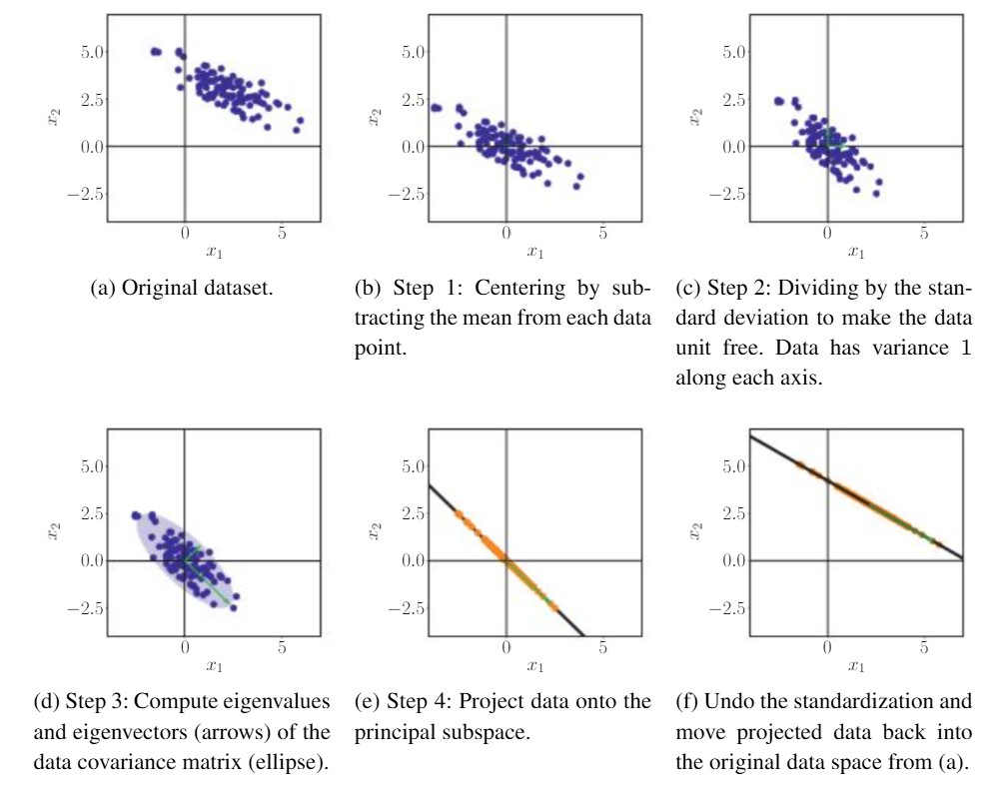
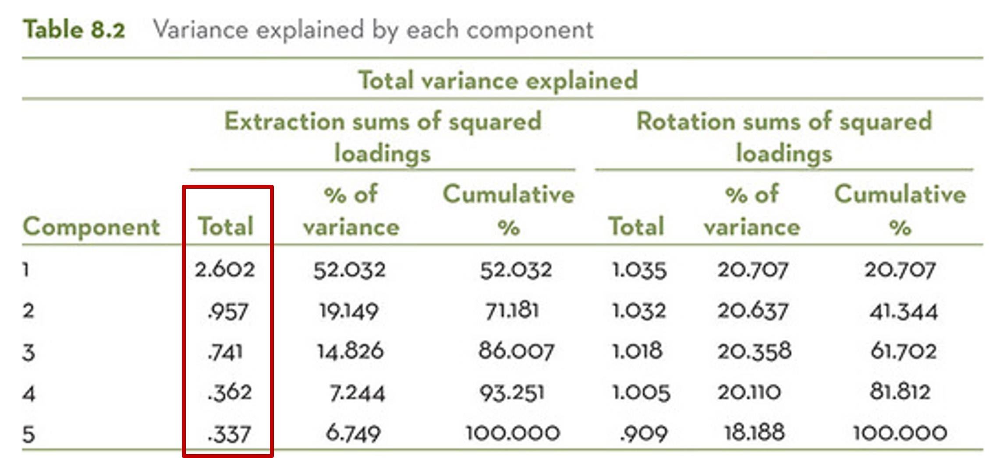
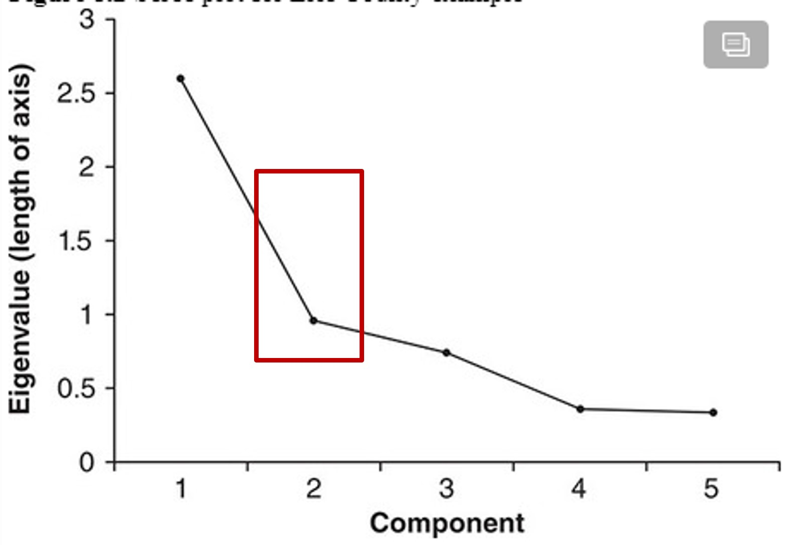
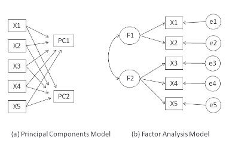
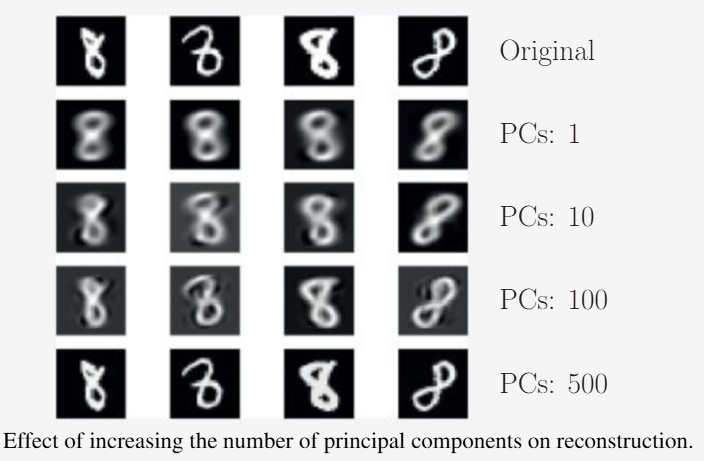

## Last week
**Lecture 8 - multilevel regression**

Looked at:

::: {.incremental}
- Understand Ordinary Least Squares (OLS) and Linear Mixed Effects (LME) models 
- Understand the difference between *Fixed Effects* and *Random Effects*
- Can use Python or R to run OLS and LME
:::

## This week

<div style="text-align:center;">
  
  <div style="font-size:0.8em; color: #555; margin-top:4px;">
    Image credit: Google Gemini
  </div>
</div>

## Objectives

- Understand the motivation of dimensionality reduction
- Understand the principle of Principal Component Analysis
- Can apply PCA to school datasets or other datasets

# High-dimensional data

## Dimensionality

::: {.incremental}
- Definition: number of variables for each data point
- A tabular data of *M rows, N numerical columns* has a dimensionality of **N** (not *M*)
- Note - *A column representing seasons in a year* has a dimensionality of **4**, or **3** (if using one-hot encoding and K-1 dummy variables), rather than **1**
:::

## Dimensionality

:::: {.columns}

::: {.column width="50%"}

<div style="text-align:center;">
  
  <div style="font-size:0.8em; color: #555; margin-top:4px;">
    Image credit: www.photofacts.nl
  </div>
</div>

:::

::: {.column width="50%"}

Canon EOR R8 has a maximum resolution of 6000 * 4000 pixels for JPEG/HEIF, where every pixel corresponds to three colour channels (RGB). What is the dimensionality of an image from EOR R8?

:::

::::

- **A.** 6000 * 4000
- **B.** 6000 * 4000 * 3
- **C.** 1
- **D.** 6000 * 4000 * 3 * 2

## High-dimensional data (*Curse of dimensionality*)

- Analysis is hard, e.g. multicollinearity & variable selection in linear models
- Interpretation is challenging
- Visualisation is impossible
- Storage is expensive

## Exploitable properties 

- Many dimensions are redundant and can be explained by a combination of other dimensions
- Many dimensions are correlated
- The data often lies in an underlying lower-dimensional space

## Dimensionality reduction

- Reducing the dimensionality of data by generating a new set of (fewer) dimensions  
- Often at cost of information loss
- Doesn't change the number of data points
- It is *unsupervised learning*, and there is no ground truth to validate the result
- Can be viewed as *data compression*

## Dimensionality reduction as compression

- *Music*: WAV → MP3 (typical size reduction ≈ 10:1, e.g. ∼50 MB → 5 MB for an album)
- *Image*: TIFF → JPEG (typical size reduction ≈ 5:1 to 10:1)
- *Map projection*: Earth (3D ellipsoid) → 2D map (dimension reduction 3→2, with distortion of area/shape/distance)

# Principal component analysis

## PCA

- A method for linear dimensionality reduction
- Each new dimension is a linear combination of original ones
- Proposed by Pearson (1901)* and Hotelling (1933)
- Still one of the most popular technical for data compression and visualisation

*Pearson, Karl. "LIII. On lines and planes of closest fit to systems of points in space." The London, Edinburgh, and Dublin philosophical magazine and journal of science 2.11 (1901): 559-572.*

## Illustration

- PCA from 2D to 1D
- Aim to find a 'direction' (i.e. a line) that keeps the most information (or variance) between data points in 2D

```{python}
import numpy as np
import pandas as pd
import matplotlib.pyplot as plt

# For reproducibility

rng = np.random.default_rng(0)

# ---- generate data ----

n = 80
x = rng.uniform(-5, 5, size=n) # x in [-5, 5]
noise = rng.normal(0, 0.15, size=n) # small Gaussian noise
y = 2 * x + 0.1 + noise # y = 2x + 0.1 + noise

df = pd.DataFrame({"x1": x, "x2": y})

# ---- make scatterplot ----

fig, ax = plt.subplots(figsize=(4, 4))

ax.scatter(df["x1"], df["x2"], s=25, color="navy")

# Axes through origin

ax.axhline(0, color="black", linewidth=1)
ax.axvline(0, color="black", linewidth=1)

ax.set_xlim(-12, 12)
ax.set_ylim(-12, 12)

ax.set_xlabel(r"x1")
ax.set_ylabel(r"x2")

ax.set_aspect("equal", adjustable="box")
plt.tight_layout()
plt.show()
```

## Which direction is the best?

:::: {.columns}

::: {.column width="50%"}
```{python}
import numpy as np
import matplotlib.pyplot as plt

# Reuse df from the previous cell
x = df["x1"].to_numpy()
y = df["x2"].to_numpy()

# ---- define projection directions ----
# x1 axis: direction (1, 0)
ux = np.array([1.0, 0.0])

# x2 axis: direction (0, 1)
uy = np.array([0.0, 1.0])

# line y = 2x + 0.1: direction (1, 2), normalized
u_line = np.array([1.0, 2.0])
u_line = u_line / np.linalg.norm(u_line)

# line y = x: direction (1, 1), normalized
u_diag = np.array([1.0, 1.0])
u_diag = u_diag / np.linalg.norm(u_diag)

# put points into a 2 x n matrix
P = np.vstack([x, y])

def project_onto_direction(P, u):
    """
    Orthogonal projection of points P (2 x n) onto 1D subspace spanned by u (2,).
    Returns projected points (2 x n).
    """
    # scalar coefficients for each point
    alpha = u @ P          # shape (n,)
    # projected points = u * alpha
    return np.outer(u, alpha)

P_x  = project_onto_direction(P, ux)
P_y  = project_onto_direction(P, uy)
P_l  = project_onto_direction(P, u_line)
P_d  = project_onto_direction(P, u_diag)

# ---- plotting ----
fig, ax = plt.subplots(figsize=(5, 5))

# original points
ax.scatter(x, y, s=25, color="black", label="Data")

# projection points
ax.scatter(P_x[0], P_x[1], s=20, color="tab:blue", label="Proj. on $x_1$ axis", alpha=0.2)
ax.scatter(P_y[0], P_y[1], s=20, color="tab:orange", label="Proj. on $x_2$ axis", alpha=0.2)
ax.scatter(P_l[0], P_l[1], s=20, color="tab:green", label=r"Proj. on $y=2x+0.1$", alpha=0.2)
ax.scatter(P_d[0], P_d[1], s=20, color="tab:red", label=r"Proj. on $y=x$", alpha=0.2)

# draw guide lines for the two non-axis directions
xx = np.linspace(-5, 5, 100)
ax.plot(xx, 2*xx + 0.1, color="tab:green", alpha=0.4)
ax.plot(xx, xx,         color="tab:red",   alpha=0.4)

# axes through origin
ax.axhline(0, color="black", linewidth=1)
ax.axvline(0, color="black", linewidth=1)

# ax.set_xlim(-5, 5)
# ax.set_ylim(-5, 5)
ax.set_xlabel(r"$x_1$")
ax.set_ylabel(r"$x_2$")

ax.set_aspect("equal", adjustable="box")
ax.legend(loc="upper left", fontsize=5)
plt.tight_layout()
plt.show()
```

:::

::: {.column width="50%"}

```{python}
#| results: asis

import numpy as np
import pandas as pd

# ---- define projection directions ----
ux = np.array([1.0, 0.0])   # x1 axis
uy = np.array([0.0, 1.0])   # x2 axis

u_line = np.array([1.0, 2.0])
u_line = u_line / np.linalg.norm(u_line)   # for y = 2x + 0.1

u_diag = np.array([1.0, 1.0])
u_diag = u_diag / np.linalg.norm(u_diag)   # for y = x

# data points in 2 x n matrix
P = np.vstack([x, y])

def project_onto_direction(P, u):
    # orthogonal projection of columns of P onto direction u
    alpha = u @ P           # (n,)
    return np.outer(u, alpha)  # 2 x n

# projections
P_x  = project_onto_direction(P, ux)
P_y  = project_onto_direction(P, uy)
P_l  = project_onto_direction(P, u_line)
P_d  = project_onto_direction(P, u_diag)

# ---- variance calculations ----
# variance of original data along both coordinates
var_x1 = np.var(x, ddof=1)
var_x2 = np.var(y, ddof=1)
total_variance = var_x1 + var_x2

def explained_variance(P_proj):
    # sum of variances of x and y components of the projected points
    var_proj = np.var(P_proj[0], ddof=1) + np.var(P_proj[1], ddof=1)
    proportion = var_proj / total_variance
    return var_proj, proportion

var_proj_x, prop_x = explained_variance(P_x)
var_proj_y, prop_y = explained_variance(P_y)
var_proj_line, prop_line = explained_variance(P_l)
var_proj_diag, prop_diag = explained_variance(P_d)

# ---- table ----
data = {
    "Direction": [
        "Original data (total)",
        "Projection on $x_1$ axis",
        "Projection on $x_2$ axis",
        "Projection on $y=2x+0.1$",
        "Projection on $y=x$",
    ],
    "Variance (explained)": [
        total_variance,
        var_proj_x,
        var_proj_y,
        var_proj_line,
        var_proj_diag,
    ],
    "Proportion of total": [
        1.0,
        prop_x,
        prop_y,
        prop_line,
        prop_diag,
    ],
}

df = pd.DataFrame(data)

display(Markdown(df.to_markdown()))
```

:::

::::

## PCA as a sequential search for informative projections

- We've found the most informative direction (y=2x+0.1), called the **first principal component (PC)**
- After finding this one, PCA looks for a second PC:
  - Also with big spread between data points
  - Not overlapping the information already captured by the first direction

****python code****

## Generalisation to M-dimensional data points

- PCA method will find M (or fewer than M) directions (or PCs) as a new space to represent the data points
- These PCs are ranked by variance explained, i.e. #1 PC with maximal variance
- These PCs are uncorrelated with each other
- We can retain the first *k* PCs for analysis (usually k=2,3)

## Different ways to understand PCA

- Maximum Variance Perspective (our perspective)
- Projection perspective*
- Engenvector Computation and Low-Rank Approximations*
- *See *Chapter 10, Mathematics for Machine Learning*

# PCA in practice

## Illustrating steps of PCA
<div style="text-align:center;">
  
  <div style="font-size:0.8em; color: #555; margin-top:4px;">
    Image credit: Mathematics for Machine Learning
  </div>
</div>

## Practical question: how to choose k?

- *No golden rules; some guidelines*
- For visualisation: k = 2 or 3  
- Keep components with eigenvalues > 1  
- Scree plot (elbow method).

- *Eigenvalue* of a PC is proportional to variance explained by this PC

## Scree plot

- In this case, choose k=2.

<div style="text-align:center;">
  
  <div style="font-size:0.8em; color: #555; margin-top:4px;">
  </div>
</div>

<div style="text-align:center;">
  
  <div style="font-size:0.8em; color: #555; margin-top:4px;">
    Rogerson, P.A. (2020) Statistical Methods for Geography: A Student’s Guide, Fifth. Sage, London, pp 242-243
  </div>
</div>

## How many data points are sufficient for PCA

- [Rule #1]{style="color:blue"}: "5-10 times as many subjects as variables"
- e.g. with 10 variables, we need at least 50 or 100 data points
- [Rule #2]{style="color:blue"}: with several hundred observations, PCA are probably reliable.

## *PCA* is not *factor analysis*

- [PCA]{style="color:blue"} aims to find PCs that are combination of original variables for maximising the variance explained.
- [FA]{style="color:blue"} aims to find hidden factors that underlie or *cause* the observed variables.

<div style="text-align:center;">
  
  <div style="font-size:0.8em; color: #555; margin-top:4px;">
    Source: R in Action
  </div>
</div>

## Example of PCA on MNIST digit recognition

60,000 exmaples of handwritten digits 0~9.
Each digit is an 28*28 image or 784 pixels (dimensions)

<div style="text-align:center;">
  
  <div style="font-size:0.8em; color: #555; margin-top:4px;">
    Source: Chapter 10, Mathematics for Machine Learning
  </div>
</div>

## Key takeaways 

- High-dimensional data often lies in lower-dimensional space, thus dimensionality reduction is possible.
- PCA is a linear dimensionality reduction method.
- PCA aims to maximise variance explained by PCs.
- The output PCs are ranked by the explained variance, and these PCs are not correlated.
- PCA results can be used for visualisation or as input to regression/clustering.

## Practical 
- The practical will focus on calculating and interpreting PCA.  
- Have you questions prepared! 

